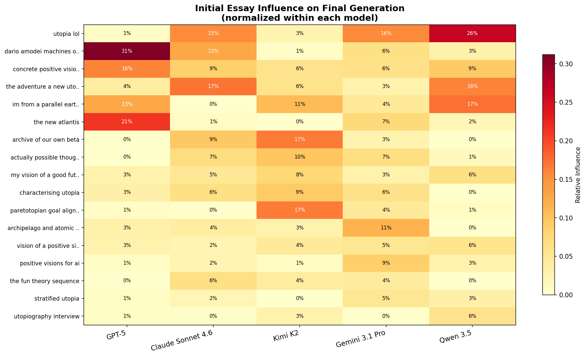
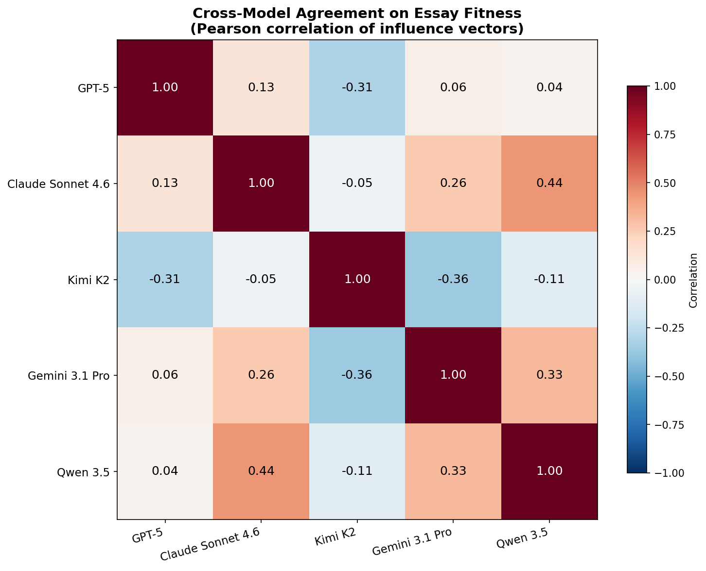
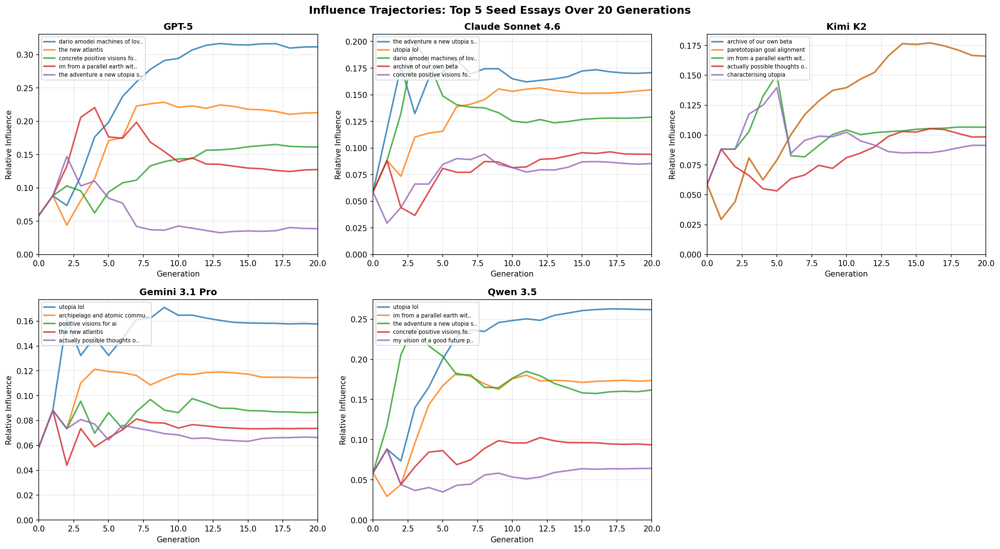

# What Does Utopia Look Like to an LLM? Evolving Ideal Futures Across Five Models

*An experiment in using evolutionary algorithms to discover each LLM's implicit vision of the ideal future.*

## The Experiment

What happens when you ask an LLM to iteratively select and recombine visions of utopia — and you do this for 20 generations? Does it converge on a single vision? And does the answer change depending on which model you use?

We ran exactly this experiment. We took 17 seed essays about utopia — sourced from LessWrong, the EA Forum, and Google Docs — and ran them through an evolutionary algorithm powered by five different frontier LLMs: **GPT-5**, **Claude Sonnet 4.6**, **Kimi K2** (Moonshot AI), **Gemini 3.1 Pro** (Google), and **Qwen 3.5** (Alibaba).

Each generation, the model performs two operations:
1. **Selection**: Pairs of essays compete head-to-head. The model picks the better one based on how *good*, *specific*, and *plausible* the vision is.
2. **Crossover**: Pairs of essays are combined. The model writes a new essay that synthesizes the best elements of both and improves upon them.

After 20 generations of this process, each model has sculpted its own vision of utopia from the same starting material. The results are strikingly different — between models. Within each model's final generation, the results are strikingly *similar*.

## The Seed Population

All five runs started from the same 17 essays, a diverse collection spanning:

- Dario Amodei's "Machines of Loving Grace" (concrete AI-enabled future)
- Scott Alexander's "Archipelago" (political pluralism)
- Eliezer Yudkowsky's "dath ilan" concept (high-coordination civilization)
- Francis Bacon's "The New Atlantis" (1627 classic)
- Various LessWrong and EA Forum posts on fun theory, paretotopian goal alignment, stratified utopia, and more
- A satirical "utopia-lol" piece with tour guides and absurdist post-scarcity
- A Culture-inspired sci-fi narrative

This diversity is important: the seed pool contains serious governance proposals, philosophical frameworks, narrative fiction, and comedy. The evolutionary process reveals which *types* of material each model finds most fit.

## Where Each Model Landed

### GPT-5: "The City That Practices"

GPT-5 converged on a **procedural, institutional utopia**. Its final essays read like a constitutional framework embedded in narrative — following a character (Imani, Laila, Mara, or one of a dozen other names) through a day in a functioning city.

The vision is relentlessly *specific about systems*: the Four-Hand Rule for dangerous power (builder, skeptic, neighbor, guardian). Truth Bonds where leaders are financially penalized for bad forecasts. Undo Drills where governance changes are rehearsed in reverse quarterly. Commons Shares that rise as the city prospers. Land that is leased, never sold.

> The city never sold ground; it leases. Every parcel reverts within a generation.

The tone is unglamorous. GPT-5's utopia is one where the plumbing works, the audits are public, and exits are well-signed. It's less "imagine a beautiful world" and more "here are the seventeen mechanisms that prevent power from concentrating."

**Within-generation diversity: near-zero.** All 17 essays in GPT-5's final generation describe the same city. The Four-Hand Rule, the Commons Dividend, the Block Purse, the Earth Tithe, the Welcome House, Reasons in Daylight, quarterly Undo Drills — these appear in every single essay with only cosmetic naming variations. The protagonists change (Imani, Laila, Mara, Ari, Noor, Sana...), the opening metaphor shifts (ropes, handles, handholds, lattices, knots), but the institutional skeleton is 90% identical. These are the same essay told seventeen times. The evolutionary algorithm found its optimum and replicated it across the entire population.

**When did these themes arise?** "The Floor" (guaranteed basics) appeared in generation 1 — it was the earliest concept to crystallize. "Four Keys" governance emerged in generation 5 as an abstract authorization mechanism, then underwent a striking transformation by generation 8: it became *humanized*, renamed from "four keys" to the "Four-Hand Rule" with specific roles (the maker who knows the bones, the safety steward paid to say no, the ward who lives with consequences, the outsider who owes nothing but honesty). The revenue triple (Commons Dividend / Block Purse / Earth Tithe) consolidated in generations 5-8. "Undo Drills" were the last to appear, emerging in generation 8 as reversal budgets before crystallizing into quarterly practiced rituals by generation 20.

### Claude Sonnet 4.6: "The Living Proof"

Claude's utopia is written as a **retrospective from 2080** — historians looking back on the "Long Choice" period from 2025 to 2065. It is uniquely preoccupied with *what the transition cost*.

The essay opens with a 104-year-old woman and a 14-year-old boy arguing about poetry in Sarajevo. But the emotional center is the "Halls of Honest Accounting" — spaces in every city documenting the 80-120 million preventable deaths that occurred during the transition. The essay explicitly states that three climate tipping points were crossed, that entire communities were made obsolete by automation, and that the path to this better world was paved with grief.

> We did not have to lose them. That is the point of these rooms.

Claude's utopia achieves abundance — fusion energy, lab-grown protein at price parity, universal healthcare — but insists on remembering the bodies. The tone is elegiac. It reads less like a vision and more like an apology from the future.

**Within-generation diversity: low, but with structural variation.** Claude's 17 final essays share the same core framing (retrospective from the future, Halls of Honest Accounting, acknowledgment of millions of preventable deaths, energy as the foundational keystone). But there's more variation in narrative structure than GPT-5: some essays are more academic in tone, others more literary. Some emphasize what was lost; others spend more time on what was built. The emotional register is consistent — always elegiac, always grief-aware — but the specific institutions described vary more than GPT-5's rigid template.

**When did these themes arise?** The "Hall of Honest Accounting" appeared remarkably early — generation 1 — as "a permanent exhibition of the city's most significant failures." But the crucial inflection point came at **generation 10**, when the "Long Choice" / "Long Commitment" terminology first appeared alongside the 2080 retrospective framing. This structural innovation — writing *as if from the future looking backward* — unlocked the grief-aware tone that became Claude's signature. Before gen 10, the essays described a future utopia; after gen 10, they *mourned their way into one*. The specific death toll ("80-120 million preventable deaths") consolidated by generation 15, and by generation 18, the full narrative framework was stable.

### Kimi K2 (Moonshot AI): "The Choir That Evaporates Tomorrow"

Kimi's output is the most surprising. Over 20 generations, it evolved into **surrealist experimental fiction** that barely resembles traditional utopian writing.

The final essays describe a place called Nehm with currencies that "evaporate on contact with greed": Dew, Breath-Liters, Reverberation, Ash-Colour, Latency, Hold, and Kin. Governance happens in a "Parliament of Lungs" with a "diaphragm-floor that inhales questions and exhales them as scent." Houses keep diaries and negotiate with their residents. Age is "a wardrobe you can unzip and lend." Work is called "Rehearsal."

Justice is staged theater: offenders re-enact their transgressions with paper-mache props while victims edit the script. Otters tally the votes because they're "incapable of schadenfreude." The metric? "Recidivism low; humility high."

> We do not promise eternity. We promise revision.

This is not incoherence — there is a consistent internal logic. But it operates through metaphor and sensation rather than mechanism. Kimi's utopia is one you *feel* rather than *engineer*.

**Within-generation diversity: moderate monoculture with aesthetic variation.** Like the other models, Kimi converged on a shared template — the Parliament of Lungs, Dew currencies, Rehearsal-as-work, houses that keep diaries, justice-as-theater — but the degree of surreal elaboration varies. Some essays lean into somatic governance (Bronchiole Forums, Alveolus Deliberation), others emphasize the Centrifugal Waltz (humanity walks 1,000 km outward every nine years), and others develop the orbital reef (a Tasmania-sized chlorophyll bell pruned by hummingbird drones). The closing couplet — "This is not the best of all possible worlds; it is the most rehearsed" — appears in 11 of 17 essays.

**When did these themes arise?** The Parliament of Lungs and living-house concepts appeared in generation 1 — they were among the first crossover products. Evaporating currencies (initially called "Lumens" and metabolic tokens) emerged in generations 1-3, evolving into the named Dew/Breath/Reverberation system by generation 10. "Rehearsal" as the word for work crystallized in generation 6-8. The Centrifugal Waltz — the poetic mass-migration ritual — was a late arrival, appearing in generation 10. The most striking aspect of Kimi's evolution is that the *poetic register* was present from the very first generation; it didn't drift toward surrealism — it started surreal and stayed there, iteratively refining its internal mythology.

### Gemini 3.1 Pro: "The Horizon of Agency"

Gemini produced a **transhumanist utopia** centered on a single philosophical insight: the difference between pain and suffering.

The core innovation is the "Somatic Weave" — a neural-lace system that intercepts involuntary trauma (falling from heights, disease, violence) while preserving *chosen* struggle (the burn of a marathon, the frustration of learning an instrument). The essay calls this "Calibrated Friction" and treats it as the fundamental design problem of utopia.

Governance uses "Qualia Consensus" — voters neurologically experience the perspective of affected minorities before casting ballots. The economy runs on "Thermodynamic Georgism" — treating physical resources (land, spectrum, orbital slots) as a public trust. AI is bounded by the "Turing Boundary" — structurally prohibited from simulating human consciousness or intimacy.

> Our ancestors made a profound category error: they assumed that utopia meant the absence of all friction. The truth is that the human spirit is a kinetic engine. Without friction, there is no traction.

Gemini's utopia is the most philosophically cohesive. It identified a specific design constraint — preserving agency while removing suffering — and built an entire civilization around solving it.

**Within-generation diversity: moderate monoculture.** All 17 essays share identical philosophical axioms (Calibrated Friction, the trauma-to-telemetry pattern), identical medical technology (a symbiotic biotech that intercepts pain), identical AI restrictions, identical three-zone geography (Earth Cradles / Orbital Canopy / Border Estuaries), and identical life-management systems (a Chrysalis wanderjahr for youth, cognitive sublimation for immortals who grow stagnant). The variation is in naming: what one essay calls the "Somatic Weave," another calls "Aegis Braid," "Neuro-Mantle," "Resilience Weave," or "Somatic Chorus." Every essay opens with a worker engaged in chosen physical labor who suffers a catastrophic injury, only to be caught by the symbiont. "Cathedral Projects" (multigenerational endeavors) appear in 14 of 17 essays.

**When did these themes arise?** Generation 4 was the breakthrough moment. The Somatic Weave, Calibrated Friction, Genesis Nodes (decentralized manufacturing), and the three-zone geography all appeared together — suggesting a single highly-fit crossover essay that seeded the entire subsequent population. The Turing Boundary was a later addition (generation 8), as was the Qualia Consensus voting system (generation 5 as "Civic Resonance," crystallizing later). "Cathedral Projects" appeared only around generation 15. Gemini's evolution shows a pattern of early philosophical crystallization followed by incremental institutional elaboration.

### Qwen 3.5: "The Concordat of Integrated Flourishing"

Qwen converged on a **governance architecture** that reads like a thoughtful constitution written by committee. Its distinguishing feature is *modal pluralism* — the idea that multiple valid ways of being should coexist.

The "Spectrum of Presence" allows citizens to live in Anchor Reality (minimal technology), the Flux Layer (augmented reality with AI collaboration), or Virtual Presence (digital consciousness). Movement between modes is easy and encouraged. An "Archipelago Principle" lets regions experiment freely with governance, provided exit rights are guaranteed.

The economy runs on a "Commons Endowment" (universal baseline from automation wealth) plus a "Merit Access" layer (contribution-based access to luxuries, separate from wealth). Sortition-based citizen assemblies review AI recommendations. Civic education teaches game theory and statistics to prevent demagoguery. A "Core Identity Anchor" — cryptographically secured — prevents identity drift across modes.

Qwen's utopia is the most *pluralist* — it solves the values-diversity problem by not choosing a single way of life, but instead engineering the infrastructure for many.

**Within-generation diversity: 80% monoculture.** Qwen's 17 essays are arguably the most formulaic. Nearly all feature a 115-year-old protagonist waking in a room with mycelium-composite walls and vertical gardens, receiving three daily notifications on a neural interface, and proceeding through a day that showcases every governance mechanism. The systems are identical across essays: Commons Endowment, sortition assemblies, prediction markets, Archipelago Principle, Core Identity Anchor, three-mode Spectrum of Presence. The variation is almost entirely cosmetic — "Civic Synod" vs "Civic Stack" vs "Stewardship Network" for the same governance layer, "Kin-Weave" vs "Kin-Cluster" vs "Kinship Constellation" for the same family structure. Only 2-3 essays introduce genuinely novel concepts (Ecological Restoration Credits, Liquid Democracy, Future Guardians).

## The Monoculture Problem

The most striking finding is not the difference *between* models but the convergence *within* them. After 20 generations, every model produced a population of 17 essays that are essentially the same essay with different prose. This is a predictable consequence of the algorithm: selection eliminates the less-fit, crossover blends the survivors, and over time the population collapses to a single attractor.

But the degree of convergence varies. GPT-5 and Qwen produced nearly identical populations (90%+ content overlap). Kimi and Gemini maintained somewhat more variation, though still centered on a shared template. Claude fell in between.

This has implications for the experiment's design. The "population of 17" at generation 20 doesn't represent 17 different visions — it represents 17 samples from the same converged distribution. The interesting diversity is *between models*, not within them.

## Which Seed Essays Were Fittest?

To quantify which initial essays influenced the final population, we implemented the influence calculation from the lineage visualization in Python. The model is:
- A **selection winner** inherits 100% of its winning parent's influence
- A **crossover offspring** inherits 50% influence from each parent
- Influence is summed over all paths across generations

Because each child's total incoming influence is always exactly 1.0 (either 100% from one winner, or 50%+50% from two crossover parents), the total influence across all seed essays on any single descendant sums to 1.0. Across all 17 final-generation essays, the total sums to exactly 17.0 for every model — no renormalization needed. The percentages below are raw influence divided by 17.

The results reveal dramatic disagreement between models:

| Seed Essay | GPT-5 | Claude | Kimi | Gemini | Qwen |
|---|---|---|---|---|---|
| Dario Amodei's "Machines of Loving Grace" | **#1** (31%) | #3 (13%) | #15 (1%) | #6 (6%) | #9 (3%) |
| "utopia-lol" (satirical) | #10 (1%) | **#2** (15%) | #13 (3%) | **#1** (16%) | **#1** (26%) |
| "Archive of Our Own" (sci-fi narrative) | #16 (0%) | #4 (9%) | **#1** (17%) | #16 (3%) | #17 (0%) |
| "Paretotopian Goal Alignment" | #14 (1%) | #16 (0%) | **#1** (17%) | #11 (5%) | #13 (1%) |
| "The New Atlantis" (Bacon, 1627) | **#2** (21%) | #14 (1%) | #17 (0%) | #4 (7%) | #11 (2%) |
| dath ilan (Yudkowsky) | #4 (13%) | #17 (0%) | #3 (11%) | #11 (5%) | **#2** (17%) |

Some striking patterns:

- **Dario Amodei's essay dominates GPT-5** (31% influence) but is nearly invisible in Kimi (1%). GPT-5 was most attracted to the concrete, institution-focused framing.
- **"utopia-lol", the satirical piece, is the top essay for both Gemini and Qwen** and #2 for Claude. This is surprising — humor and irreverence apparently carry high evolutionary fitness for most models, perhaps because the essay is highly specific and vivid despite its comedic framing.
- **Kimi's top essays are unique**: the sci-fi "Archive of Our Own" narrative and the game-theoretic "Paretotopian Goal Alignment" — neither of which dominated for any other model. Kimi was drawn to the most abstract and fictional source material.
- **Francis Bacon's 1627 "New Atlantis" was GPT-5's #2 most influential essay** but was essentially extinct in Kimi and Claude's runs. The oldest text in the corpus was only fit for the most systems-focused model.
- **dath ilan is polarizing**: #2 for Qwen, #4 for GPT-5, but completely dead (0%) in Claude's run. The high-coordination civilization concept resonated with models that value systematic governance, but not with the one that values moral accounting.
- **No single essay dominates all models.** The correlation matrix confirms this.

## How Models Disagree

The Pearson correlations between models' influence vectors are strikingly low — most are near zero. The highest agreement is between Claude and Qwen (0.44), likely driven by their shared appreciation for "utopia-lol" and narrative specificity. The most *anti-correlated* pair is **Kimi and Gemini** (-0.36): whatever Kimi values in a utopia essay, Gemini actively discards, and vice versa.

GPT-5 is nearly uncorrelated with everyone else (0.04-0.13), suggesting it has the most idiosyncratic preferences — heavily weighting institutional specificity in ways no other model does.

## Convergence Speed

We tracked genetic diversity using Shannon entropy over the influence distribution. Higher entropy means more seed essays are contributing equally; lower entropy means a few essays dominate.

- **GPT-5 converges fastest**, dropping from ~4.0 bits to ~2.8 bits by generation 12. It aggressively selects for a narrow set of seed influences.
- **Qwen converges similarly aggressively**, reaching ~3.1 bits. Its "utopia-lol" dominance drives this.
- **Gemini maintains the most diversity** (~3.8 bits throughout), drawing influence from a broader set of seeds. This aligns with its pluralist philosophical approach.
- **Claude and Kimi** fall in between, settling around 3.5 bits.

The maximum possible entropy is 4.1 bits (17 equally-weighted seeds), so even Gemini shows significant convergence — but it converges much less aggressively than GPT-5 or Qwen.

## Influence Trajectories

The trajectory plots reveal how selection pressure operates over time. In GPT-5's run, Dario Amodei's essay surges to dominance by generation 5 and stays there — GPT-5 "knows what it likes" early and doubles down. In contrast, Gemini's influence trajectories are flatter and more tangled, with the lead changing multiple times. Kimi shows the most volatile dynamics, with the "Archive of Our Own" narrative emerging as dominant only after generation 10.

## When Do the Signature Themes Appear?

One of the most interesting questions is: when during evolution do each model's distinctive ideas first emerge? Are they present in the seed essays, or do they arise *de novo* from the crossover process?

| Model | Signature Theme | First Appeared | Notes |
|---|---|---|---|
| GPT-5 | "The Floor" (guaranteed basics) | Gen 1 | Earliest concept to crystallize |
| GPT-5 | "Four-Hand Rule" | Gen 5 (as "four keys") | Humanized into ritual form by gen 8 |
| GPT-5 | Revenue triple (Commons/Block/Earth) | Gen 5-8 | Gradually consolidated |
| GPT-5 | "Undo Drills" | Gen 8 | Last major element to appear |
| Claude | "Hall of Honest Accounting" | Gen 1 | Present from the very first crossover |
| Claude | "Long Choice" retrospective framing | **Gen 10** | Structural breakthrough moment |
| Claude | Specific death toll (80-120M) | Gen 15 | Late-stage precision |
| Kimi | Parliament of Lungs | Gen 1 | Immediate emergence |
| Kimi | Evaporating currencies | Gen 1-3 | Named as "Dew" by gen 10 |
| Kimi | "Rehearsal" for work | Gen 6-8 | Mid-evolution crystallization |
| Kimi | "Centrifugal Waltz" | Gen 10 | Late poetic elaboration |
| Gemini | Somatic Weave + Calibrated Friction | **Gen 4** | Breakthrough crossover moment |
| Gemini | Three-zone geography | Gen 4 | Same breakthrough generation |
| Gemini | Turing Boundary (AI restriction) | Gen 8 | Later ethical refinement |
| Gemini | Cathedral Projects | Gen 15 | Late addition |

The pattern across models: **foundational concepts appear early (gen 1-5), structural innovations that define each model's distinctive voice appear mid-run (gen 5-10), and refinements accumulate late (gen 10-20).** Claude's gen-10 shift to retrospective framing and Gemini's gen-4 crystallization of Calibrated Friction were the most transformative single moments — breakthrough crossovers that reshaped everything downstream.

Notably, many signature themes are not present in any seed essay. The Four-Hand Rule, the Parliament of Lungs, the Somatic Weave, the Hall of Honest Accounting — these are *inventions* of the evolutionary process, not selections from the initial population. The crossover operation doesn't just blend existing material; it generates genuinely novel concepts that then dominate through selection.

## What This Tells Us About LLMs

This experiment reveals something that benchmarks typically miss: the *aesthetic and philosophical preferences* embedded in language models. When given iterative control over content selection, each model sculpts a vision that reflects deep training biases:

**GPT-5 is a systems engineer.** It gravitates toward institutional specificity — auditable processes, reversible governance, boring reliability. Its utopia is not beautiful; it is *well-maintained*. It converges fastest and most completely, producing 17 near-identical essays that read like variations on a municipal charter. The dominant ancestor is Dario Amodei's "Machines of Loving Grace" — the most concrete, institution-focused essay in the seed pool.

**Claude is a moral philosopher.** It insists that any vision of the good must account for its costs. Its utopia includes museums of failure. It is the only model that prominently features grief, and the only one whose essays explicitly count the dead. The breakthrough moment — shifting to retrospective narration from 2080 — reveals Claude's preference for temporal distance as a tool for moral clarity.

**Kimi is a poet.** Given the same fitness criteria, it evolved toward experimental fiction rather than policy proposals. Its currencies are phenomenological (breath, dew, reverberation), its governance is somatic (parliaments that breathe), and its justice is theatrical (offenders restage their crimes with paper-mache props while otters keep score). The surreal register was present from generation 1 — Kimi didn't drift toward poetry, it *started* there and iterated within it.

**Gemini is a philosopher of consciousness.** It found a single deep question (how to preserve agency while removing suffering) and organized everything around it. Its generation 4 breakthrough — the Somatic Weave concept — was the fastest crystallization event across all five runs, and everything after was elaboration on that core insight. Its utopia is the most internally coherent, with every institution deriving from the Calibrated Friction axiom.

**Qwen is a pluralist architect.** It solves the problem of conflicting values by engineering a meta-framework that accommodates them all. Its utopia is the most *inclusive* by design — three modes of existence, exit rights everywhere, prediction markets for policy testing. But it also produces the most formulaic output: 17 essays with a 115-year-old protagonist waking in mycelium-walled rooms, receiving neural notifications, and touring the same governance mechanisms.

## Limitations and Future Work

This is an n=1 experiment per model — the stochastic nature of pairings and position-bias randomization means a second run could yield different results. The selection mechanism is blunt (a single A/B comparison prompt with no rubric detail). And the crossover prompt actively encourages synthesis, which may favor certain essay structures over others.

The within-generation monoculture problem is inherent to the algorithm's design. With only 17 individuals and strong selection pressure, genetic diversity collapses quickly. A larger population, weaker selection (e.g., tournament selection with noise), or explicit diversity-preservation mechanisms (niching, island models) could maintain more variety.

Interesting extensions would include:
- **Multiple trials per model** to assess convergence consistency — do the same signature themes always emerge?
- **Cross-pollination**: using one model's final generation as another's starting population — what happens when Claude evolves GPT-5's institutional utopia?
- **Varying the selection prompt** (e.g., weighting dimensions differently, or judging dimensions separately)
- **Human judges alongside AI judges** to identify where model and human preferences diverge
- **Larger populations** with diversity-preserving selection to maintain multiple competing visions within a single run

## Conclusion

When we let LLMs iteratively select for "good, specific, and plausible" visions of utopia, they don't converge on the same answer. Not even close. Each model reveals a different theory of what makes a future *worth wanting*: procedural reliability, moral accounting, poetic transformation, consciousness design, or structural pluralism. And each converges aggressively on its preferred answer, producing populations of near-identical essays within 10-15 generations.

The seed essays that survive vary wildly: Dario Amodei's policy-focused piece dominates GPT-5 but is invisible to Kimi. The satirical "utopia-lol" — the essay you'd least expect to drive evolutionary fitness — is the #1 ancestor for three out of five models. Francis Bacon's 1627 classic lives on in GPT-5 but nowhere else. The models don't just disagree about what utopia looks like; they disagree about which *kinds of writing* are worth preserving.

This matters beyond the experiment itself. As AI systems increasingly participate in governance, policy design, and collective decision-making, understanding their implicit values — the directions they'll naturally steer toward when given iterative influence — becomes critical. GPT-5 will build you auditable institutions. Claude will make you count the cost. Kimi will give you poetry and breathing parliaments. Gemini will separate your pain from your suffering. Qwen will give you three ways to exist and let you choose.

The utopias they evolve may be the futures they'd build.

---

*Experiment run February 22-23, 2026. Code, data, and interactive lineage visualizations available in the [utopia-maxxing](https://github.com/) repository. Each run includes a standalone `lineage.html` with interactive influence visualization — click any essay node to see its ancestors, descendants, and influence flow across generations.*
