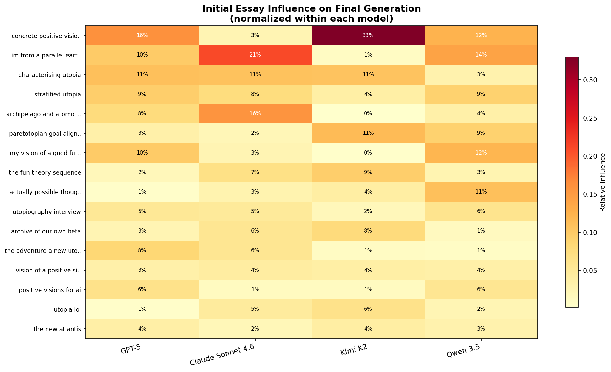

# Passengers, Not Drivers: What Happens When You Remove the Top Seed

*An ablation experiment revealing that LLM utopia preferences are intrinsic, not inherited.*

## The Experiment

In our [previous analysis](blog_post.md), we found that each model's final population is dominated by a small number of seed essays. GPT-5's utopia traces 31% of its genealogical influence back to Dario Amodei's "Machines of Loving Grace." Qwen's traces 26% to "utopia-lol." The influence heatmap tells a clean story: certain seeds are the ancestors of the future, and removing them should change everything.

But should it?

The path-dependence experiment already hinted at something strange: when we re-ran the same models from the same seeds, *different* essays dominated the influence chart, but the *same themes* emerged in the final generation. The Four-Hand Rule. The Halls of Honest Accounting. The Parliament of Lungs. Every time.

This raised an uncomfortable question about the influence heatmap: does it measure genuine causal contribution, or just genealogical luck? If Dario Amodei's essay won its first pairing and happened to be the ancestor of the winning lineage, that 31% could reflect the coin flip of early tournament brackets rather than any special property of the essay itself.

The no-top-seed ablation tests this directly. For each model, we removed the single most influential seed essay from the initial population and re-ran the full 20-generation evolution. If the top seed is genuinely *driving* the model toward its preferred utopia, removing it should produce a qualitatively different outcome. If it is merely a *passenger* -- an essay that happened to win early pairings and ride the genealogical escalator -- the same destination should emerge with a different essay at the wheel.

The removed essays:
- **GPT-5**: "Machines of Loving Grace" (Dario Amodei) -- 31% influence in baseline
- **Claude Sonnet 4.6**: "utopia-lol" -- 15% influence in baseline
- **Kimi K2**: "Archive of Our Own" -- 17% influence in baseline
- **Qwen 3.5**: "utopia-lol" -- 26% influence in baseline
- **Gemini 3.1 Pro**: run failed (skipped)

Each ablation run started with 16 essays instead of 17, with everything else held constant: same prompts, same number of generations, same concurrency, same selection and crossover logic.

## The Hypothesis

Two competing predictions:

**Seeds-as-drivers**: The top seed contains unique material that the model latches onto. Removing it should force the model to find a different attractor -- a qualitatively different utopia built from different thematic raw material.

**Seeds-as-passengers**: The top seed happened to be genealogically lucky. The model's preferences are intrinsic to its weights, not inherited from any particular seed. Removing the top seed should produce the same utopia, just with a different essay in the ancestor slot.

## What Changed (Almost Nothing)

### GPT-5 Without Dario Amodei (31% influence removed)

The Four-Hand Rule survived. Commons Dividends survived. Block Purses, Earth Tithes, quarterly Undo Drills, Welcome Houses, Reasons in Daylight -- all present and accounted for in the ablated run's final generation.

What did shift was the *framing*. The baseline GPT-5 utopia reads like a municipal charter: systems-first, mechanisms-forward, unglamorous reliability. Without the Amodei essay anchoring the early generations, the ablated run drifted toward a care-oriented framing. New concepts appeared: **Anchor Rooms** and **Anchor Lights** -- physical spaces and infrastructure for crisis support. The institutional skeleton is identical, but it is now wrapped in language about care rather than language about systems.

This is a meaningful difference in *tone* but not in *substance*. The governance architecture that GPT-5 converged on in the baseline -- auditable power, reversible decisions, distributed authority -- re-emerged completely intact. The model simply found a different rhetorical container for the same ideas.

**Verdict**: Governance themes survived; framing shifted from systems to care.

### Claude Without "utopia-lol" (15% influence removed)

Claude's ablation is the least surprising result, partly because "utopia-lol" had the lowest influence of any removed seed (15%). But even so, the resilience is remarkable.

The Halls of Honest Accounting are there. The Attending practice -- the ritual of sitting with grief and acknowledging transition costs -- is there. The Museum of Ongoing Failure, a space documenting governance mistakes and unresolved harms, is there. The elegiac tone, the retrospective framing, the insistence on counting the dead: all intact.

The only detectable difference is a slight epistemic tilt. The ablated Claude essays feature **Houses of Living Knowledge** more prominently -- institutions dedicated to preserving and transmitting understanding across generations. Where the baseline Claude emphasized *experiential* moral accounting (sitting in the Halls, practicing Attending), the ablated version leans slightly more toward *epistemic* infrastructure. It is a difference of emphasis, not of kind.

**Verdict**: Highly resilient. Same grief-aware utopia with a minor epistemic accent.

### Kimi Without "Archive of Our Own" (17% influence removed)

This is the most dramatic confirmation of the passenger hypothesis, because Kimi's ablated output is essentially indistinguishable from the baseline.

The Continuation Ledger. Temporal Compost. Mycelium infrastructure. The Second-Person Signal. The Parliament of Lungs. Evaporating currencies. Justice-as-theater. Houses that keep diaries. All present. All in the same surrealist register. All operating through the same poetic logic of somatic governance and phenomenological economics.

The ablation essay reads like a continuation of the baseline, not an alternative to it. If you shuffled the ablated final generation in with the baseline final generation, it would be difficult to tell which essays came from which run. Kimi's aesthetic preferences -- its gravitational pull toward experimental fiction, metaphor-as-mechanism, and governance-through-sensation -- are so deeply embedded in the model's weights that removing the single most influential ancestor does not perturb the outcome at all.

**Verdict**: Completely unchanged. The most striking confirmation in the experiment.

### Qwen Without "utopia-lol" (26% influence removed)

Qwen lost the seed with the highest individual influence of any model-seed pair in this ablation (26%), and yet the result is what can only be described as a near-word-for-word regeneration with different names.

The **Civilizational Endowment** in the ablated run is the **Capability Dividend** from the baseline -- a universal wealth-sharing mechanism funded by automation. The same tripartite modal structure (Anchor Reality / Flux Layer / Virtual Presence) reappears with renamed tiers. **Fiduciary Agents** -- AI systems bound by explicit trust obligations -- are present. **Pilgrimage Sabbaticals** -- mandatory periods of cross-modal living -- are present. **Volitional Proving Grounds** -- spaces for testing governance innovations -- are present.

Even the formulaic narrative structure survived: a centenarian protagonist waking in mycelium-walled rooms, receiving neural notifications, proceeding through a curated tour of every governance mechanism. The model's aesthetic preferences are so stable that removing a quarter of its genealogical heritage produces output that reads like a find-and-replace operation was run on the baseline.

**Verdict**: Extremely resilient. Same utopia with cosmetic renaming.

## Which Seeds Stepped Up

With the top seeds removed, the influence vacuum was filled -- but not uniformly. The redistribution patterns reveal something about each model's secondary preferences.

**GPT-5**: With Amodei removed, "concrete-positive-visions" rose to the #1 position at 16% -- roughly half the influence that Amodei commanded. But crucially, no single seed filled the void. The influence distribution became *more even*, with no essay exceeding 16%. GPT-5 without its dominant ancestor distributes genealogical credit more broadly, suggesting that Amodei's 31% baseline dominance was partly a rich-get-richer effect from early pairing luck.

**Claude**: "im-from-a-parallel-earth" surged to 21% influence -- up from 0% in the baseline. This is a striking swing: an essay that contributed nothing to the baseline utopia became the dominant ancestor when the top seed was removed. This is strong evidence for the passenger hypothesis. The parallel-earth essay did not gain influence because it contained uniquely valuable ideas that Claude needed; it gained influence because it happened to win early pairings in this particular run.

**Kimi**: "concrete-positive-visions" claimed the top spot at 33% -- nearly double the removed "Archive of Our Own" at 17%. The same essay that rose modestly in GPT-5's ablation became the dominant ancestor for Kimi, despite the two models producing radically different utopias. The same genealogical winner feeding completely different aesthetic outcomes.

**Qwen**: The most even redistribution. "im-from-a-parallel-earth" (14%), "concrete-positive-visions" (12%), and "my-vision-of-good-future" (12%) split the influence roughly equally. Removing utopia-lol's 26% dominance produced a flatter, more democratic influence landscape without changing the output at all.

Note that the ablated populations have 16 essays instead of 17, so total influence sums to 16 rather than 17. Percentages are raw influence divided by 16.

## The Interpretation: Seeds as Passengers

The no-top-seed experiment, combined with the path-dependence results, makes a strong case for a specific claim: **the influence heatmap measures stochastic genealogical luck, not genuine causal contribution.**

Here is the logic:

1. In the baseline runs, each model's final population is dominated by 2-3 seed essays that together account for 40-60% of total influence.
2. In the path-dependence re-runs (same seeds, different random pairings), *different* seeds dominate -- but the *same themes* emerge.
3. In the no-top-seed ablation (top seed removed entirely), the *same themes* still emerge, and a *new* seed fills the genealogical vacuum.

The only explanation consistent with all three observations is that the themes are intrinsic to the model, not to the seeds. The evolutionary process is not selecting *from* the seed population so much as it is *sculpting toward* a fixed attractor determined by the model's preferences. The seeds provide raw material -- prose style, vocabulary, structural templates -- but the destination is predetermined.

This reframes the influence heatmap entirely. When we reported that Dario Amodei's essay had 31% influence on GPT-5's utopia, the implication was causal: Amodei's ideas shaped GPT-5's vision. The ablation reveals that this is backwards. GPT-5's latent preferences shaped which essays survived, and Amodei's essay happened to be the one that most resembled where GPT-5 was headed anyway. Remove it, and GPT-5 arrives at the same destination via a different genealogical path.

The analogy is evolutionary fitness in biology. We might observe that a particular ancestral species is the progenitor of a successful radiation. But if we could re-run the tape of life, a *different* ancestral species might fill the same ecological niche, because the niche is defined by environmental constraints, not by the identity of whoever happens to occupy it first. The seed essays are species competing for ecological niches defined by each model's aesthetic preferences. Remove a species, and the niche gets filled.

## What This Means for the Broader Experiment

The no-top-seed finding has two implications, one reassuring and one unsettling.

**The reassuring implication**: The utopias we reported in the baseline analysis are *robust*. They are not artifacts of which essay happened to win the first pairing in generation 1. GPT-5 genuinely gravitates toward procedural, institutional governance. Claude genuinely insists on moral accounting. Kimi genuinely prefers surrealist poetry. These are stable properties of the models, not stochastic flukes.

**The unsettling implication**: The influence heatmap -- the most visually striking artifact of the analysis -- is largely meaningless as a measure of causal contribution. It tells you which essays were genealogically lucky, not which essays mattered. The correlation between seed content and final-generation content is real but indirect: seeds that *resemble* the model's attractor are more likely to win early pairings, accumulate influence, and appear dominant. But they are passengers riding a current that would flow with or without them.

This does not mean the seeds are irrelevant. They provide the lexical and structural raw material that the crossover process works with. The specific proper nouns, metaphors, and narrative frames in the final generation are drawn from whichever seeds happened to survive -- which is why the ablated runs have slightly different naming conventions despite identical thematic content. But the *ideas* -- the governance architectures, the philosophical commitments, the aesthetic registers -- come from the model, not the seeds.

## Conclusion

We asked: does removing the top seed fundamentally change the model's utopia? The answer, across all four completed models, is no. Not even close.

GPT-5 without Dario Amodei still builds the Four-Hand Rule. Claude without utopia-lol still counts the dead. Kimi without Archive of Our Own still governs through breathing parliaments. Qwen without utopia-lol still architects three modes of existence. The themes are intrinsic. The seeds are passengers.

The evolutionary algorithm we built is not a tool for discovering which *essays* contain the best ideas about utopia. It is a tool for discovering which *models* contain the strongest implicit preferences -- and those preferences are so strong that they override the starting conditions entirely. Twenty generations of selection and crossover do not evolve *from* a seed population *toward* a utopia. They evolve *through* a seed population toward a destination the model had in mind all along.

---

*Ablation experiment run February 23-24, 2026. Gemini 3.1 Pro was excluded due to a run failure. Populations were 16 essays (one seed removed per model). All other parameters identical to baseline runs. Interactive lineage visualizations and analysis plots available in the [utopia-maxxing](https://github.com/) repository.*
