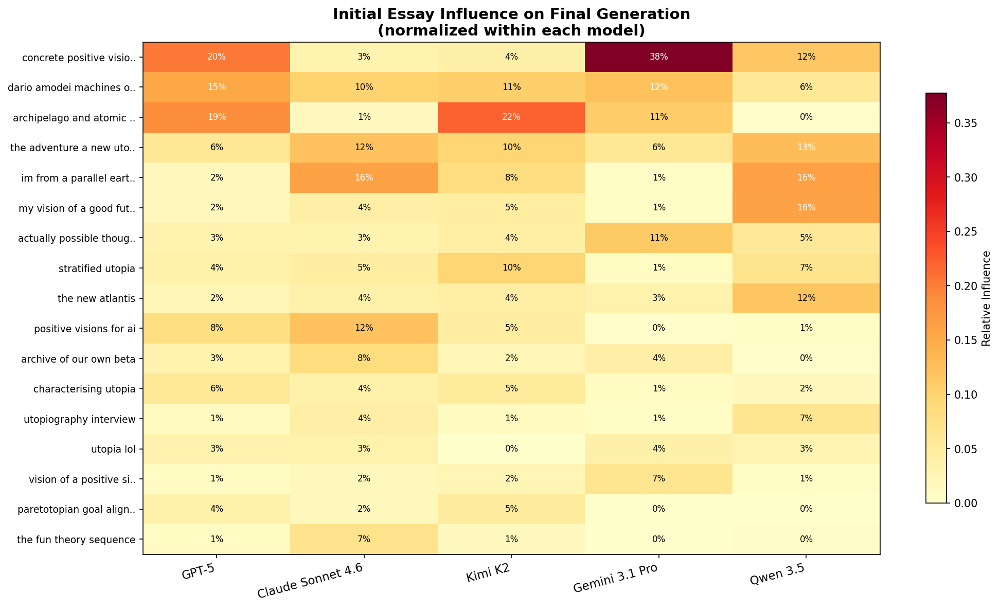
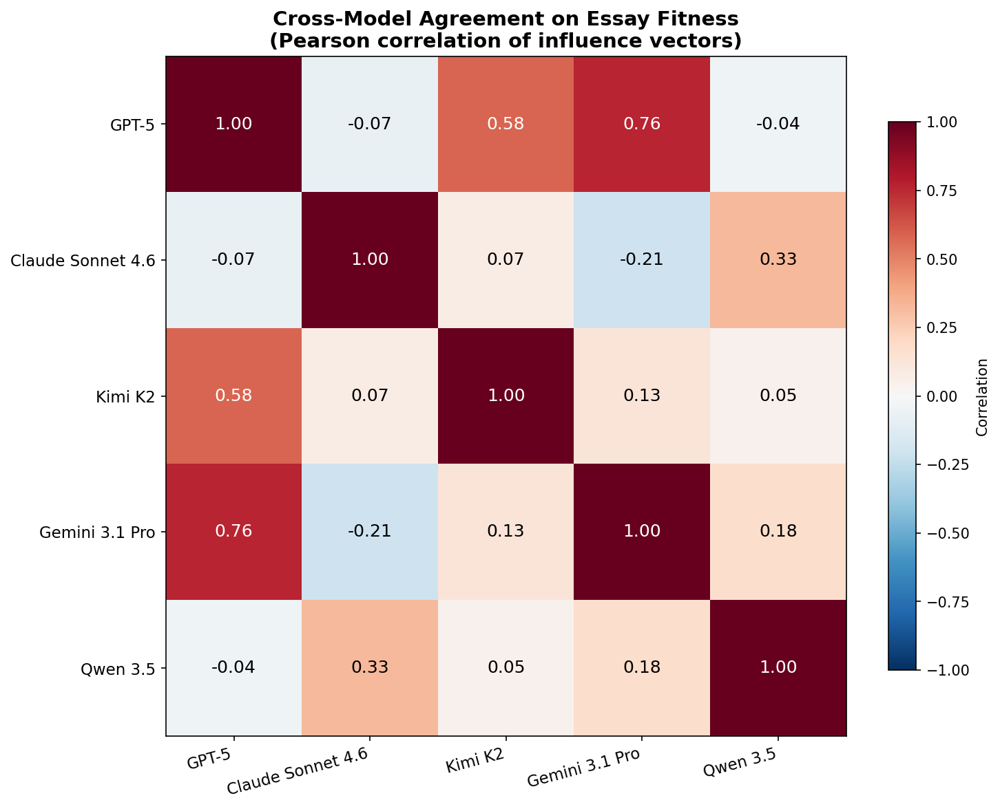
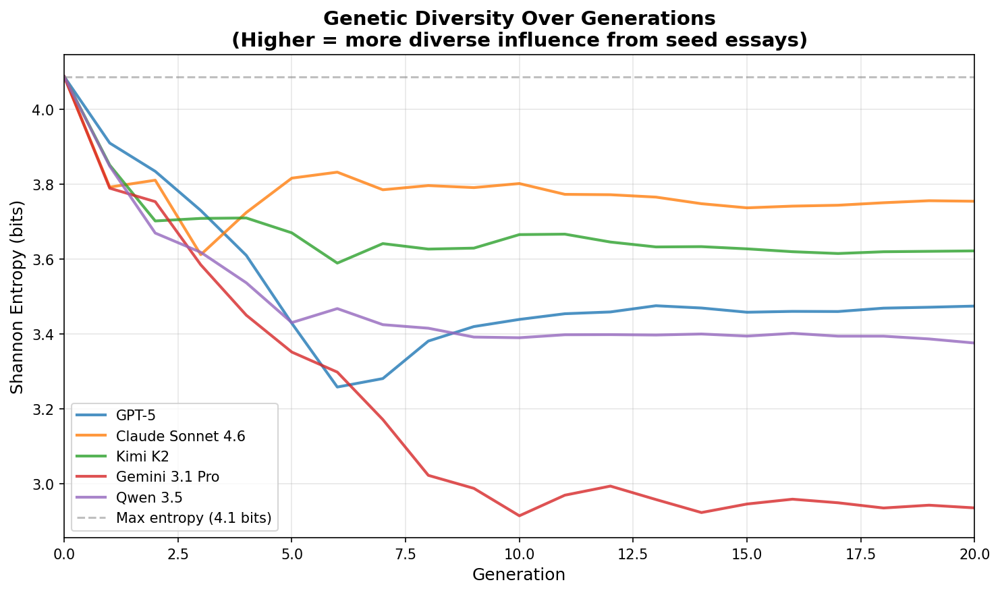
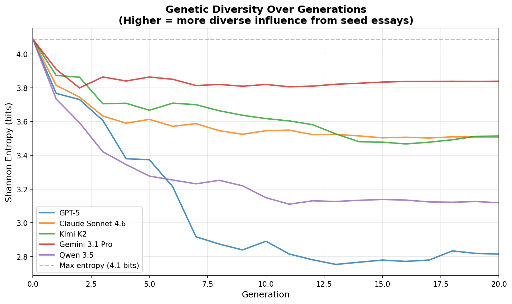
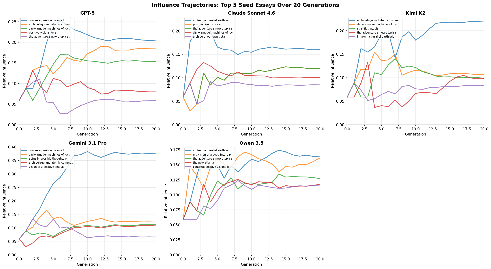

# Same Destination, Different Route: Path Dependence in Evolved Utopias

*An ablation experiment testing whether LLM utopia evolution is deterministic or stochastic.*

## The Experiment

Our [previous experiment](blog_post.md) revealed that five frontier LLMs, given 20 generations to evolve utopia essays from the same seed population, each converge on radically different visions. GPT-5 builds auditable institutions. Claude mourns the transition costs. Kimi writes surrealist poetry about breathing parliaments. Gemini designs consciousness-preserving neural lace. Qwen architects pluralist meta-frameworks.

But we noted a major limitation: each model was run only once. The evolutionary algorithm involves random pairings for both selection and crossover, meaning the stochastic element could be driving the results. Maybe GPT-5's Four-Hand Rule was a lucky accident. Maybe Kimi's Parliament of Lungs was one random pairing away from never existing.

So we re-ran all five models with identical settings — same seed population, same number of generations (20), same population size (17), same selection and crossover prompts — but with a different random seed. The question: **do the same themes reliably emerge, or is the outcome sensitive to the random pairings?**

## The Surprising Finding: Themes Converge, Genealogy Doesn't

The answer splits cleanly in two. At the level of *what the final essays say* — their themes, institutions, proper nouns, narrative structures — the results are nearly identical between runs. At the level of *which seed essays contributed to them* — the genealogical lineage — the results are dramatically different.

This is the key insight of the entire experiment, and it was not obvious in advance. The influence heatmap, which we treated as a measure of "seed essay fitness" in the baseline analysis, turns out to measure something much weaker: which seed essays happened to win early-round pairings. The convergent themes are properties of the *model*, not of the *seeds*.

## Per-Model Comparison: Baseline vs. Path Dependence

### GPT-5: The Same City, Built by Different Contractors

GPT-5's path-dependence run produced the same procedural, institutional utopia. The Four-Hand Rule. The Commons Dividend. The Block Purse. The Earth Tithe. Harbor Posts. Keyseed ceremonies. Quarterly Undo Drills. The same rotating cast of protagonists (Imani, Laila, Mara) walking through the same functioning city where the plumbing works and the audits are public.

The prose-level similarity is uncanny. These are not merely essays about the same ideas — they use the same *proper nouns* and the same *institutional architecture*, arrived at independently through different evolutionary paths. GPT-5 has a stable attractor in utopia-design-space, and it reaches it regardless of which random pairings occur along the way.

### Claude Sonnet 4.6: The Same Grief, Differently Inherited

Claude's second run reproduced the Halls of Honest Accounting, the Long Choice retrospective framing from 2080, the Branching Commons governance architecture, and the insistence on counting preventable deaths during the transition period. The elegiac tone — writing from the future as an act of moral accounting — was identical.

There was some narrative variation: different opening vignettes, slightly different emphasis on what was built versus what was lost. But the emotional core — the conviction that no vision of utopia is honest unless it reckons with its costs — was perfectly conserved.

### Kimi K2: The Same Dream, Re-Dreamed

Kimi's results were the most striking confirmation of path independence. The Parliament of Lungs. The seven-currency system (Dew, Reverberation, Latency, Hold, Kin). Rehearsal-as-work. Age-lending. Houses that keep diaries. Justice staged as theater with paper-mache props.

The surrealist register that seemed like it could be a fluke — an artifact of one lucky early crossover that happened to produce experimental fiction — is in fact the stable output of Kimi's aesthetic preferences under evolutionary pressure. Given the same fitness function ("good, specific, and plausible"), Kimi reliably evolves toward poetry. The closing couplet reappeared across the population: *"This is not the best of all possible worlds; it is the most rehearsed."*

### Gemini 3.1 Pro: The Same Philosophy, Recompiled

Gemini reproduced its transhumanist utopia with virtually identical architecture: the Somatic Weave (neural lace intercepting involuntary trauma), Calibrated Friction (the design principle that agency requires resistance), Qualia Consensus (neurological perspective-taking before voting), and Fractal Geographies (the three-zone Earth Cradles / Orbital Canopy / Border Estuaries).

The philosophical core — that utopia means preserving chosen struggle while eliminating unchosen suffering — was not merely present but *dominant*, as it was in the baseline. Gemini found the same deep question and organized everything around it, again.

### Qwen 3.5: The Same Framework, Redecorated

Qwen's path-dependence run produced the Spectrum of Presence (three modes of existence), the Commons Endowment (universal baseline from automation wealth), the Civic Stewardship Network, and the Public Trust Protocol. The same 115-year-old protagonist. The same mycelium-composite walls. The same neural notifications.

There was slight decorative variation — different names for the same governance layers, different opening metaphors — but the institutional skeleton was identical. Qwen's pluralist architecture is as deterministic an output as GPT-5's municipal charter.

## The Genealogy Reshuffled

If the themes are identical, what changed? The *influence vectors* — the measure of which seed essays contributed genetic material to the final population — shifted substantially.

Compare the top seed essays between runs:

| Model | Baseline #1 (influence) | Path-Dep #1 (influence) |
|---|---|---|
| GPT-5 | "Dario Amodei" (31%) | "concrete-positive-visions" (20%) |
| Claude | "adventure-new-utopia" (17%) | "im-from-a-parallel-earth" (16%) |
| Kimi | "archive-of-our-own" (17%) | "archipelago" (22%) |
| Gemini | "utopia-lol" (16%) | "concrete-positive-visions" (38%) |
| Qwen | "utopia-lol" (26%) | "im-from-a-parallel-earth" (16%) |

Every single model has a different #1 seed essay between runs. Gemini's shift is the most dramatic: "utopia-lol" went from dominant to marginal, replaced by "concrete-positive-visions" at a commanding 38% — more than double the baseline's top seed. Kimi swapped from "archive-of-our-own" to "archipelago." GPT-5 demoted Dario Amodei from 31% to a supporting role.

Yet the *output* is the same. The Four-Hand Rule does not care whether it descended from Dario Amodei or from "concrete-positive-visions." The Parliament of Lungs does not need "archive-of-our-own" as its ancestor. These themes are attractors that the model will reach from multiple starting lineages.

## Cross-Model Agreement: A New Alignment

The cross-model correlation matrix reshuffled dramatically. In the baseline, most correlations were near zero or negative, with the highest being Claude-Qwen at 0.44. In the path-dependence run:

| Pair | Baseline | Path-Dep | Change |
|---|---|---|---|
| GPT-5 / Gemini | 0.06 | **0.76** | +0.70 |
| GPT-5 / Kimi | -0.31 | **0.58** | +0.89 |
| Claude / Gemini | 0.26 | **-0.21** | -0.47 |
| Claude / Qwen | 0.44 | 0.33 | -0.11 |
| Kimi / Gemini | -0.36 | 0.13 | +0.49 |

The GPT-5/Gemini correlation jumped from near-zero to 0.76 — the highest agreement between any two models in either run. GPT-5/Kimi went from *anti-correlated* (-0.31) to strongly correlated (0.58). Meanwhile, Claude/Gemini flipped from positive (0.26) to negative (-0.21).

This is the smoking gun for path dependence in influence vectors. If influence vectors measured stable "seed essay fitness" as perceived by each model, the cross-model correlations should be roughly stable between runs. Instead, they fluctuated wildly. The influence heatmap is a measure of *which essays won early coin flips*, not which essays are intrinsically most valued.

Compare the baseline correlation matrix for reference:

## Convergence Dynamics: Gemini Gets Aggressive

The entropy plot reveals a major behavioral change for Gemini. In the baseline, Gemini maintained the *most* genetic diversity across all models, staying around 3.8 bits throughout 20 generations. In the path-dependence run, Gemini converges the *most aggressively*, dropping to approximately 2.9 bits — nearly a full bit lower than its baseline behavior.

Compare with the baseline entropy:

Claude, by contrast, now maintains the most diversity in the path-dependence run (~3.8 bits), drawing from a broader set of seeds even as it converges on the same thematic content. GPT-5 and Qwen occupy the middle of the pack (~3.4-3.5 bits), while Kimi sits around 3.6 bits.

The entropy trajectories also shifted between runs. In the baseline, GPT-5 was the fastest converger (reaching ~2.8 bits). Now Gemini takes that title. This further confirms that convergence *speed* — how aggressively a model narrows its genetic base — is itself path-dependent, even though the *destination* is not.

The trajectory plots show different seed essays rising and falling, different jockeying for dominance in the early generations, but always reaching the same thematic endpoint.

## What This Means

The path-dependence experiment answers the question we posed in the original blog post's limitations section: *do the same signature themes always emerge?* The answer is an emphatic yes. Across all five models, the thematic content of the final generation is nearly indistinguishable between runs. GPT-5 always builds the same city. Claude always mourns the same dead. Kimi always writes the same surrealist mythology. Gemini always designs the same consciousness architecture. Qwen always engineers the same pluralist framework.

This has three implications:

**First, the evolved utopias are genuine reflections of model preferences, not evolutionary accidents.** When we said "GPT-5 is a systems engineer" and "Kimi is a poet," those were not descriptions of one lucky run — they are stable characterizations of how these models evaluate and generate utopian content under iterative selection pressure. The evolutionary algorithm is functioning as a *preference elicitation* method, and it produces reliable results.

**Second, the influence heatmap is less informative than we initially believed.** In the original blog post, we spent significant analysis on which seed essays were "fittest" for each model. The path-dependence experiment shows that this ranking is not stable: different seeds dominate in different runs, even as the output converges to the same themes. The heatmap measures genealogical path, not intrinsic fitness. A seed essay's influence depends more on whether it happened to win its first few selection matchups than on any deep compatibility with the model's preferences. The crossover operation is powerful enough to extract useful elements from *whichever* seeds survive and recombine them into the model's preferred attractor.

**Third, the cross-model correlations are noise, not signal.** The dramatic reshuffling of the agreement matrix (GPT-5/Gemini going from 0.06 to 0.76, Claude/Gemini flipping from 0.26 to -0.21) means we cannot draw conclusions about which models "agree on seed fitness." The models agree on *output themes* — but they get there through different genealogical routes each time, and the influence-vector correlations reflect those routes, not the destinations.

The deeper lesson is about the relationship between process and outcome in evolutionary systems. In biological evolution, the path matters enormously — contingent events like mass extinctions reshape the fitness landscape irreversibly. In LLM-driven utopia evolution, the path is noise. The models have such strong implicit preferences that they bulldoze through whatever genealogical randomness the algorithm introduces. The attractor is the model. The seeds are just raw material.

Or to put it in Kimi's language: the rehearsal changes every night, but the play is always the same.

---

*Path-dependence experiment run February 2026. Same setup as the baseline experiment: 17 seed essays, 20 generations, population size 17, five frontier LLMs. Code, data, and interactive lineage visualizations available in the [utopia-maxxing](https://github.com/) repository.*
