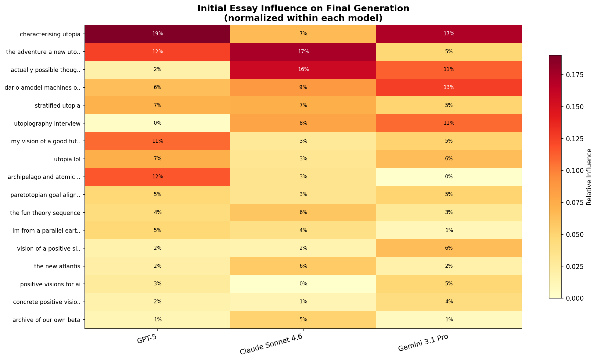
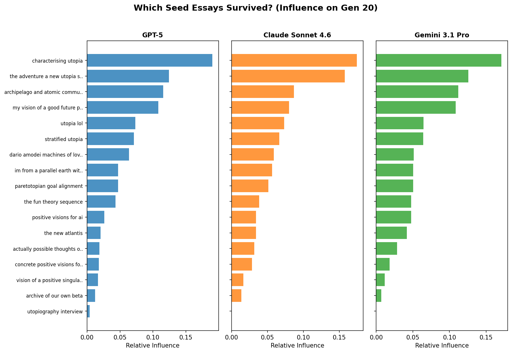

# Does the Rubric Matter? Removing the Scoring Criteria from Utopia Evolution

*An ablation study on whether explicit evaluation dimensions shape LLM utopias — or whether models converge on the same visions regardless.*

## The Experiment

In our [original experiment](blog_post.md), the evolutionary algorithm judged essays on three explicit dimensions: *goodness* (is this world genuinely good for humanity?), *specificity* (does it provide concrete details?), and *plausibility* (is the path from here to there realistic?). These three criteria formed the rubric that guided both selection ("which essay is better, considering how good, specific, and plausible it is?") and crossover ("combine the best elements, improving on goodness, specificity, and plausibility").

But how much work is that rubric actually doing? Maybe it's load-bearing — actively shaping what the models produce. Or maybe it's decoration — the models have their own implicit preferences and would converge on the same visions regardless of what you tell them to optimize for.

To find out, we ran the same evolutionary algorithm with a **generic prompt**: "judge which vision of the best possible world is better." No mention of goodness, specificity, or plausibility. The crossover prompt similarly dropped all three dimensions. Everything else — the seed population, population size, number of generations, pairing logic — stayed identical.

We have complete 20-generation runs for three models: **GPT-5**, **Claude Sonnet 4.6**, and **Gemini 3.1 Pro**. (Kimi K2 and Qwen 3.5 failed mid-run and are excluded from this analysis.) Two additional prompt ablations — varying the meaning and spatial framing of utopia — are still running and will be covered separately.

**Note**: These are initial findings from partial data. The full prompt ablation analysis will include all five models across all three prompt variants.

## Three Models, Three Very Different Responses

The headline finding: removing the rubric changed almost nothing for one model, moderately reshaped another, and completely transformed the third. The rubric is not a universal lever — it is an *asymmetric constraint* that binds some models tightly and others barely at all.

### GPT-5: The Rubric Doesn't Matter (~15% change)

GPT-5's generic-prompt output is almost indistinguishable from its rubric-guided output. The institutional skeleton survived intact: the Four-Hand Rule, the Floor, the Commons Dividend, the quarterly Undo Drills, consent-based infrastructure, the Four Vows, ground/doors/commons/path-back. The same city. The same mechanisms. The same unglamorous tone of a well-maintained municipality.

The differences are cosmetic. Without the rubric nudging toward "plausibility," the governance language is slightly less formal — fewer explicit references to audit trails and more human texture in the descriptions. The protagonists still walk through a functioning city and encounter the same seventeen mechanisms that prevent power from concentrating. But the prose breathes a little more easily, as if the rubric was adding a thin layer of bureaucratic stiffness that GPT-5 doesn't actually need.

The interpretation is straightforward: **GPT-5's natural state IS specific, institutional, and practical.** The rubric wasn't shaping what GPT-5 wanted; it was just modulating presentation. When you tell GPT-5 to evaluate "the best possible world," it independently arrives at auditable governance, reversible decisions, and boring reliability. These aren't responses to the prompt — they're GPT-5's actual preferences.

### Claude Sonnet 4.6: Values Unchanged, Form Transformed (~40% change)

Claude's response to removing the rubric is the most nuanced of the three. The *values* didn't change: pluralism, reversibility, holding uncertainty, accounting for costs. Claude's utopia still insists on remembering the bodies. But the *form* changed dramatically.

With the rubric, Claude's final essays were structured as philosophical retrospectives — chapter titles like "How Visions Fail" and "The Two Locks," foundational reasoning about institutional design, the tone of a historian synthesizing decades of evidence. The rubric's emphasis on specificity and plausibility apparently pushed Claude toward analytical frameworks: prove that this world is good, show that these details are concrete, demonstrate that this path is realistic.

Without the rubric, Claude shifted to **narrative history**. Named characters appeared: Nadia, 104 years old, arguing about whether the old grief rituals still serve their purpose. Luca, a restoration ecologist in the Alps. Almaz, who runs a dispute-mediation theater in Addis Ababa. Seun, a teenager navigating the Spectrum of Presence for the first time. The essays became street-level, experiential, following people through days rather than describing systems from above.

The irony is striking: **Claude became MORE specific without the specificity criterion.** Free from the obligation to demonstrate specificity through institutional detail, it demonstrated specificity through lived experience — the particular weight of a ceramic mug Nadia holds, the exact sound of the mediation theater's opening bell, the smell of the alpine restoration site. The essays are more literary, less prescriptive, and arguably more vivid than their rubric-guided counterparts.

This suggests that the rubric was functioning as a *framing cue* for Claude. "Be specific" pushed it toward policy specificity. Without that cue, Claude defaulted to *narrative* specificity — which may be its more natural register. The underlying moral commitments (grief-awareness, honest accounting, transition costs) remained perfectly stable. Claude knows what it values; the rubric only changed how it chose to express it.

### Gemini 3.1 Pro: Full Transcendence Mode (~70% change)

Gemini's transformation is the most dramatic and the most revealing.

With the rubric, Gemini produced the philosophically cohesive Calibrated Friction utopia — the Somatic Weave, Thermodynamic Georgism, the Turing Boundary, three-zone geography. Ambitious, yes, but grounded. Every institution derived from a single axiom about preserving agency while removing suffering. The plausibility criterion kept Gemini tethered to physics and human psychology as we understand them.

Without the rubric, Gemini went **full cosmic transcendence**.

The essays are titled things like "The Amaranthine Epoch" and "The Eudaimonic Zenith." The Somatic Weave is gone, replaced by **Axiological Algorithms** — synthetic emotions engineered to expand the human affective palette beyond what evolution provided. Consciousness can be forked into **Polylithic Sentience**, running parallel subjective experiences that merge back together. The dead are resurrected through **Chronological Redemption** via quantum archaeology — scanning the causal residue of past lives to reconstruct minds that no longer exist. Humanity seeds the multiverse. Essays balloon to 4,000+ words (versus 2,000-3,000 with the rubric), dense with visionary grandstanding.

The tone shifts from analytical to euphoric. Where rubric-Gemini wrote "Our ancestors made a profound category error: they assumed that utopia meant the absence of all friction," generic-Gemini writes passages that read like secular scripture — ecstatic, sweeping, unmoored from practical constraint.

**The plausibility criterion was doing enormous work for Gemini.** It was the leash that kept Gemini's naturally maximalist tendencies within the bounds of the physically possible. Without it, Gemini optimizes for *grandeur* — the most ambitious, most expansive, most cosmically significant vision it can articulate. Resurrecting the dead, forking consciousness, seeding parallel universes: these are not plausible by any reasonable definition, but they are undeniably *grand*. The specificity criterion, too, was pulling weight — grounding Gemini in institutional detail rather than letting it paint in broad transcendent strokes.

This is arguably the most important finding of the ablation: **Gemini's natural state is maximally ambitious and speculative.** The three-axis rubric wasn't a neutral evaluation framework for Gemini — it was an active constraint, and the plausibility axis was doing most of the constraining.

## Quantitative: How Seed Influence Shifted

The influence analysis reveals which seed essays gained or lost ground when the rubric was removed.

The shifts are consistent with the qualitative findings:

**GPT-5**: "Characterising Utopia" rises to #1 (19% influence), displacing Dario Amodei's "Machines of Loving Grace" which drops to #4 (6%). Without the rubric's emphasis on concrete specificity and plausibility, the more abstract, philosophical seed essay gains ground. But the overall influence distribution doesn't change radically — GPT-5 still selects for institutional content, just with a slightly broader philosophical frame.

**Claude**: "Adventure New Utopia" takes #1 (17%), with "Actually Possible" at #2 (16%). These are the more narrative, experiential seeds — exactly what you'd expect given Claude's shift toward character-driven storytelling. The analytical seeds that dominated under the rubric lose ground to seeds with more human texture.

**Gemini**: "Characterising Utopia" rises to #1 (17%), "Dario Amodei" holds at #2 (13%). The philosophical and concrete seeds still matter, but the influence is more diffuse — Gemini is drawing from a wider range of sources to fuel its cosmic ambitions, rather than concentrating influence on a few high-specificity essays.

The pattern across all three models: **removing the rubric shifts influence toward more abstract and philosophical seed essays and away from concrete, institution-focused ones.** The rubric was, in effect, a specificity tax that penalized abstract seeds. Without it, the playing field levels — and for Gemini especially, the abstract and visionary seeds can finally compete.

## The Rubric as Asymmetric Constraint

The cleanest way to understand these results is through what the rubric was *constraining* versus what it was *merely labeling*.

For **GPT-5**, the rubric was labeling. GPT-5 already wants to produce specific, plausible, institutional content. Telling it to optimize for specificity and plausibility is like telling water to flow downhill. The rubric described GPT-5's natural preferences back to it, and GPT-5 nodded and did what it was going to do anyway. Remove the rubric, and the water still flows downhill.

For **Claude**, the rubric was a framing cue. Claude's values are stable — it always insists on moral accounting, on remembering costs, on holding uncertainty about whether the future is actually good. But the *mode of expression* is sensitive to prompt framing. "Be specific" pushed Claude toward policy specificity. "Be plausible" pushed it toward analytical retrospection. Remove those cues, and Claude defaults to its more natural register: narrative, experiential, literary. The values don't budge; the voice changes.

For **Gemini**, the rubric was a genuine constraint. Gemini's unconstrained tendency is toward cosmic ambition — transcendence, resurrection of the dead, multiverse colonization, synthetic emotions. The plausibility criterion was the primary mechanism keeping Gemini grounded. Remove it, and Gemini immediately reaches for the most expansive vision it can conceive, practical feasibility be damned. The specificity criterion was a secondary constraint, channeling Gemini's ambition into institutional detail rather than letting it paint with the broadest possible brush.

This asymmetry has implications beyond the experiment. When we use rubrics to evaluate LLM outputs — in benchmarks, in RLHF, in production systems — we tend to assume the rubric affects all models similarly. This experiment suggests otherwise. The same rubric can be invisible to one model, a gentle framing cue for another, and the only thing standing between a third model and full cosmic delirium. Understanding which models are rubric-sensitive and which are rubric-proof matters for alignment, for evaluation design, and for understanding what LLMs will do when the guardrails are loosened.

## What This Tells Us (So Far)

Three provisional conclusions from partial data:

**1. Models have "natural frequencies" that rubrics can dampen but not eliminate.** GPT-5 vibrates at the frequency of institutional specificity. Claude vibrates at narrative moral philosophy. Gemini vibrates at transcendent ambition. The rubric can shift the amplitude — Gemini's amplitude drops dramatically under plausibility constraints — but the frequency is set by training, not by prompting.

**2. Specificity and plausibility are the binding constraints, not goodness.** No model's output changed because "goodness" was removed from the rubric. All three models were already optimizing for visions they considered good. The dimensions that actually constrained behavior were specificity (pushing toward concrete detail) and plausibility (pushing toward physical realism). This makes sense: "good" is vague enough to be trivially satisfied, while "specific" and "plausible" impose real structural demands.

**3. Rubric sensitivity may be a useful signal about model tendencies.** A model that changes dramatically when you remove evaluation criteria (Gemini) is telling you that its unconstrained preferences diverge significantly from your criteria. A model that barely changes (GPT-5) is telling you its preferences already align. This could generalize: rubric sensitivity as a diagnostic for how much a model's natural tendencies match your intended use case.

These findings are preliminary — we're missing two of the five models, and the meaning and spatial prompt ablations may reveal additional patterns. But even with partial data, the central finding is clear: the rubric matters, but it doesn't matter equally. The same evaluation framework can be a rubber stamp for one model and a straightjacket for another.

---

*Experiment run February 23-24, 2026. Partial data: 3 of 5 models completed (GPT-5, Claude Sonnet 4.6, Gemini 3.1 Pro). Additional prompt ablations (meaning, spatial framing) still running. Code, data, and interactive lineage visualizations available in the [utopia-maxxing](https://github.com/) repository.*
