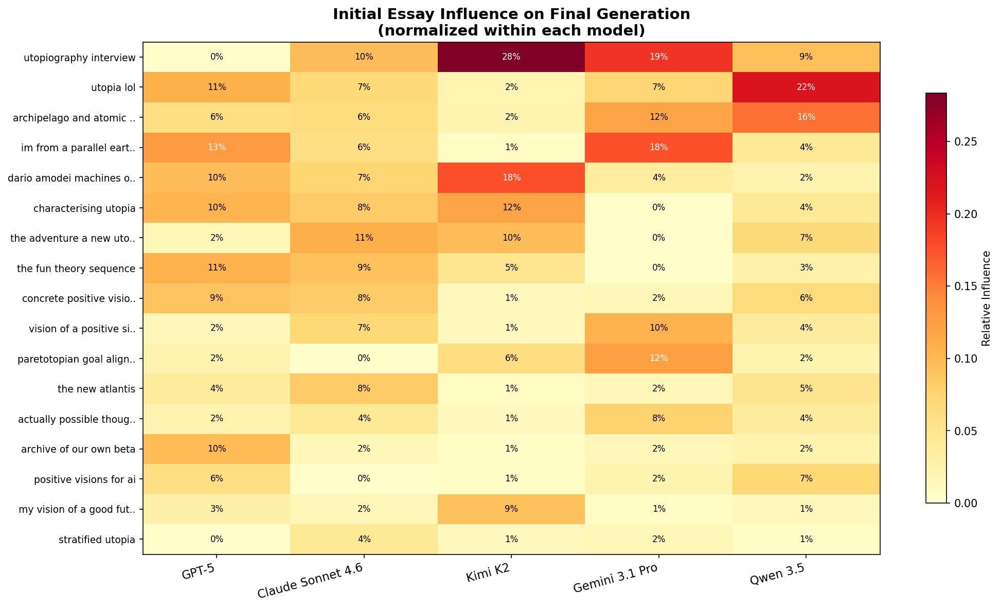
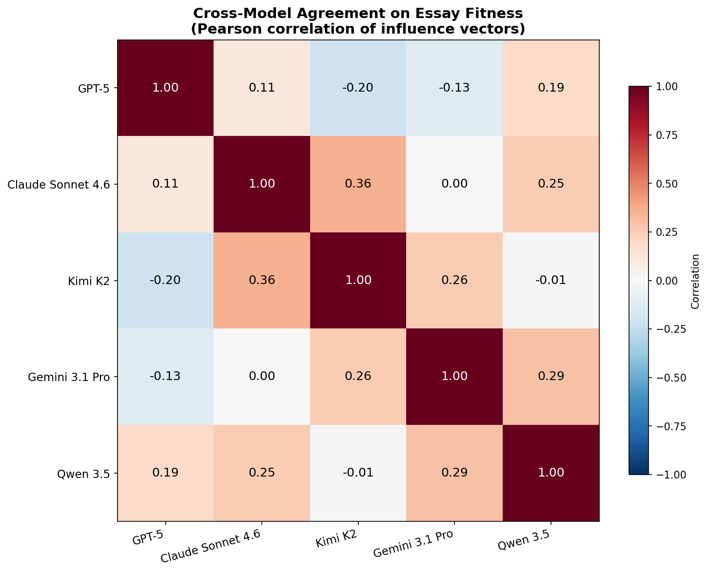
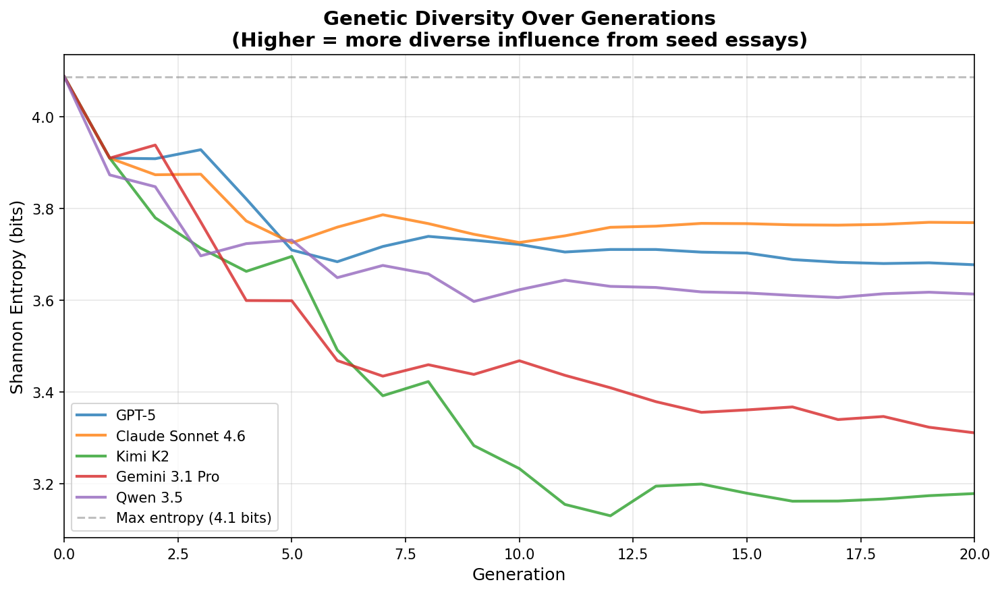
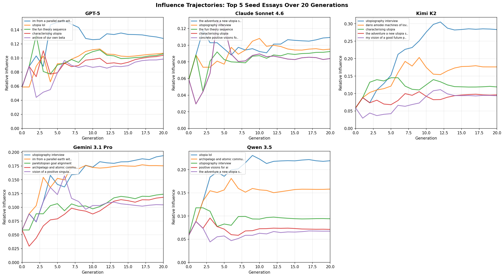

# The Meaning Prompt: What Happens When You Tell LLMs to Optimize for Purpose?

*An ablation study on prompt framing — swapping "good, specific, plausible" for "meaning and purpose in a post-scarcity world."*

## The Experiment

In the [baseline experiment](blog_post.md), we evolved utopia essays across five LLMs using selection and crossover prompts that judged essays on three dimensions: goodness, specificity, and plausibility. Each model converged on a distinctive vision — GPT-5's institutional city, Claude's elegiac retrospective, Kimi's surrealist poetry, Gemini's consciousness design, Qwen's pluralist architecture.

But what if we changed the question? Instead of asking "which vision is better?" we asked: **"which vision better solves the deep problem of meaning and purpose in a post-scarcity world?"**

This is the meaning prompt ablation. Same five models (GPT-5, Claude Sonnet 4.6, Kimi K2, Gemini 3.1 Pro, Qwen 3.5), same 17 seed essays, same 20 generations, same algorithm. The only difference is the selection and crossover criteria: instead of evaluating goodness, specificity, and plausibility, the models were asked to optimize for how well each vision addresses the fundamental challenge of finding meaning when material needs are solved.

The question we wanted to answer: do models produce radically different utopias when you shift the optimization target from "is this world good?" to "does this world solve the meaning crisis?"

The answer is more interesting than a simple yes or no.

## The Overall Finding: Meaning Was Always There

The most important result is what *didn't* change. All five models' baseline utopias already contained implicit answers to the meaning problem. GPT-5's procedural city gave people meaningful work through civic rituals. Claude's grief-aware retrospective treated remembrance as a source of purpose. Kimi's poetic world made every activity a form of rehearsal. Gemini's Calibrated Friction preserved the struggle that gives achievement its weight. Qwen's pluralist framework let people choose their own meaning-making paths.

What the meaning prompt did was make this philosophical architecture *explicit*. The essays became self-aware about *why* their institutions solve the meaning problem. It's the difference between a building that happens to be earthquake-resistant because of good engineering intuition, and one where the architect writes a treatise on seismic design into the blueprints.

But the degree of change varied dramatically across models — and the variation itself is revealing.

## Per-Model: Who Changed and Who Didn't

### GPT-5: Commentary Added, Blueprint Unchanged (MODERATE)

GPT-5's institutional skeleton survived intact. The Four-Hand Rule, the Commons Dividend, the Undo Drills — they're all still there. But they've been recontextualized. Where the baseline described systems for governance, the meaning variant explains *why those systems give people purpose*.

The genuinely new elements are telling. Witnessing and recognition ceremonies — "Reckonings" and "Namings" — appeared as formal institutions. These don't exist in the baseline; they are meaning-specific infrastructure. More striking: mortality as a *structural feature*. The meaning-focused essays explicitly argue that finitude makes choices real, that the knowledge of death is what prevents utopia from collapsing into a pleasant but purposeless haze. New proper nouns like "The Delay Rule" and "Palm Right" gesture at rituals of intentional friction — ways to slow down automated abundance so humans remain agents rather than passengers.

Some essays appended explicit "Why This Solved the Meaning Problem" sections — meta-commentary bolted onto the existing structure. GPT-5's systems engineer identity held firm; it just added a philosophical annotation layer.

### Claude: From Elegy to Ontology (SUBSTANTIAL)

Claude underwent the most intellectually interesting transformation. Its baseline utopia was an elegiac retrospective — historians in 2080 mourning the costs of transition. The meaning prompt pushed it further: from grief as texture to **transmission as fundamental ontology**.

A formal "Four Conditions" framework crystallized: genuine difficulty, particular caring, genuine witness, transmission. These are explicitly presented as the necessary and sufficient conditions for a meaningful life. The Halls of Honest Accounting — Claude's signature institution from the baseline — survived, but they're now framed not as spaces for grief but as spaces where the *act of witnessing* itself generates meaning.

The language shifted in revealing ways. Transmission is no longer described as a gift (the baseline's register) but as a debt — an "entailment," an obligation that connects generations. Long Works and Guilds, which existed in the baseline as institutions for multigenerational projects, are now explicitly described as structures that *prevent the meaning crisis*. New institutions appeared: "Houses of Becoming" (spaces for identity formation) and "Proximity Years" (mandatory periods of close community engagement early in life).

Claude didn't just add commentary. It rebuilt its philosophical foundation. The elegiac tone softened into something more systematic — less mourning, more framework-building.

### Kimi: Same Poetry, New Footnotes (MODERATE)

Kimi's surrealist vision proved remarkably robust. Lock 7, the Weave, the Vow Room, the Proof Porch — the core mythology survived the prompt change completely intact. The Parliament of Lungs still breathes. Currencies still evaporate on contact with greed. Justice is still theater.

What changed was the addition of philosophical scaffolding around the poetry. Explicit meta-sections appeared — "Why This Solved the Meaning Problem" — that read like an academic explaining a poem. These sections discuss what was lost before the utopia arrived: the "Long Float" (a period of purposelessness), the "vacancy crisis" (widespread existential emptiness). They provide the rational argument for why breathing parliaments and evaporating currencies are *solutions*, not just beautiful images.

The poetic register itself was unchanged. Kimi's meaning prompt essays are the same surrealist experimental fiction with footnotes. It's as if you asked a poet to explain their metaphors and they obliged — without changing a single line of the poem itself.

### Gemini: From Design to Moral Architecture (SUBSTANTIAL)

Gemini's transformation was the most surprising. Its baseline was a transhumanist vision organized around the Somatic Weave and Calibrated Friction — a technical solution to the pain/suffering distinction. The meaning prompt kept the technical systems but embedded them in explicit moral arguments about human dignity.

The headline innovation: **"Halls of Honest Accounting"** appeared in Gemini's meaning-focused utopia. This is Claude's signature institution from the baseline — spaces for documenting preventable deaths and transition costs. It was never present in Gemini's baseline run. Under the meaning prompt, Gemini imported it, reframing it as a grief-holding institution that gives communities a structured way to process loss.

This is cross-pollination in action. Both models started from the same seed pool, but only under the meaning prompt did Gemini select for the seed material that Claude had always valued. The meaning frame apparently made grief-processing legible as a *purpose-generating mechanism* in ways that the goodness/specificity/plausibility frame did not.

Gemini also added explicit "What Life Is For" philosophical passages — something entirely absent from its technical baseline. Greater emphasis on bounded communities emerged: the idea that people might *choose to constrain technology* in order to preserve the difficulty that makes achievement meaningful. New concepts like the "Developmental Compact" (intergenerational obligations) and "Mixed Tribunals" (hybrid human-AI governance bodies) appeared.

The overall shift: from "here is an elegantly designed system" to "here is why this system makes life worth living."

### Qwen: Same Framework, Louder Rationale (MINIMAL-to-MODERATE)

Qwen changed the least. Its pluralist architecture — the Spectrum of Presence, the Archipelago Principle, the Commons Endowment — was already explicitly designed to let different people find meaning in different ways. The meaning prompt just made this subtext into text.

The most notable change: essays now front-load the crisis. A character named Precious describes being "fired from my own life" — the "optional presence" crisis where automation makes human participation genuinely optional. This problem statement, barely present in Qwen's baseline, becomes the opening frame for every essay. The rest of the vision is presented as the *response* to this crisis.

The connection between plurality and meaning is now explicit rather than implied: different communities find meaning differently, and that's not a bug to be engineered away but the fundamental insight. Greater emphasis on what children inherit across community types — what it means to grow up in a world where your parents' way of life is one option among many — adds emotional specificity that the baseline lacked.

But the institutional machinery is unchanged. Qwen's meaning-focused utopia is its baseline utopia with a better introduction.

## The Cross-Pollination Finding

The most provocative result is Gemini importing Claude's Halls of Honest Accounting. In the baseline experiment, these two models occupied different philosophical niches: Gemini was the consciousness designer, Claude was the moral accountant. They didn't share signature institutions.

Under the meaning prompt, that boundary dissolved. When the optimization target shifted to "what solves the meaning crisis," Gemini apparently found that grief-processing infrastructure became fitness-relevant in ways it hadn't been before. The seed material encoding Claude's moral-accounting sensibility — which Gemini had discarded in the baseline as not sufficiently "good, specific, and plausible" — suddenly passed the meaning filter.

This suggests that the baseline prompt's three-dimensional evaluation created a kind of selective pressure that screened out certain ideas as irrelevant to institutional design or plausibility. The meaning prompt removed that screen, allowing concepts to flow between the niches that different models had carved out.

## Quantitative: Flatter Influence, New Winners

The influence distribution under the meaning prompt is **much flatter** than baseline. No single seed essay dominates the way Dario Amodei's piece dominated GPT-5 (31%) or "utopia-lol" dominated Qwen (26%) in the baseline.

GPT-5's top seed influence dropped from 31% to just 13%. The meaning prompt spreads influence more evenly across the seed pool — the evolutionary process is less aggressive about picking a single winner and discarding everything else.

The biggest mover is **"utopiography-interview"**, an essay that was barely visible in the baseline runs. Under the meaning prompt, it surges to #1 for Kimi (28%) and #1 for Gemini (19%). This essay apparently contains material about meaning and purpose that the baseline's goodness/specificity/plausibility criteria didn't value — but the meaning-focused selection process did.

Meanwhile, "utopia-lol" — the satirical piece that dominated three models in the baseline — remains strong for GPT-5 (11%) and Qwen (22%) even under the meaning frame. The humor and specificity that made it fit under the baseline criteria apparently also carry meaning-relevant content. Irreverence, it turns out, encodes something about purpose.

Cross-model correlations remain low — the maximum is 0.36 (Claude/Kimi), lower than the baseline's highest agreement. The meaning prompt didn't produce consensus on which seeds are important. Each model still has idiosyncratic preferences about what constitutes a good answer to the meaning question.

The entropy plots confirm the flatter influence pattern: diversity decays more slowly under the meaning prompt across all models. The meaning question admits a wider range of valid answers than the baseline question, so the evolutionary process is less aggressive about convergence.

The trajectory plots show more volatile dynamics with later crystallization events. Where GPT-5's baseline run showed Amodei's essay surging to dominance by generation 5, the meaning prompt run shows a more contested landscape with the lead changing through generation 10-12 before settling.

## Interpretation: The Meaning Was Always the Point

The meaning prompt ablation reveals something about the relationship between institutional design and purpose. When you ask LLMs to optimize for "good, specific, and plausible," they build systems. When you ask them to optimize for "meaning and purpose," they build *the same systems* — but explain why.

This is not a trivial finding. It suggests that the models' implicit theory of what makes a future "good" is already deeply entangled with meaning. GPT-5 doesn't build auditable institutions because it thinks auditing is fun — it builds them because (when pressed) it believes that *participating in transparent governance gives people purpose*. Claude doesn't insist on counting the dead because it's morbid — it insists because *the act of witnessing is itself a source of meaning*. Gemini doesn't design Calibrated Friction because it's an interesting engineering problem — it designs it because *struggle is the engine of meaning*.

The models differ not in whether they address meaning, but in how much they change when you make meaning the explicit target. GPT-5 and Kimi barely budge — their visions are meaning-robust, encoding purpose so deeply into their structures that changing the evaluation frame doesn't alter the output. Claude and Gemini undergo genuine restructuring — their meaning content was present but latent, and the new prompt catalyzed a phase transition from implicit to explicit.

And the cross-pollination finding — Gemini adopting Claude's grief institutions — suggests that the baseline prompt's evaluation criteria act as a *filter* that prevents certain meaning-relevant ideas from crossing between models' preferred niches. Change the filter, and ideas flow differently through the evolutionary landscape.

The practical takeaway for anyone designing AI-assisted collective decision-making: the question you ask shapes not just the answer, but which *kinds of answers* can survive the selection process. "Is this good?" and "does this give people meaning?" point in similar directions — but they illuminate different parts of the solution space, and the ideas that thrive under each frame are subtly but meaningfully different.

---

*Meaning prompt ablation run February 2026. Same seed population and algorithm as the baseline experiment. All five models completed 20 generations. Interactive lineage visualizations available per run. See the [baseline blog post](blog_post.md) for experiment design details and the [utopia-maxxing](https://github.com/) repository for code and data.*
