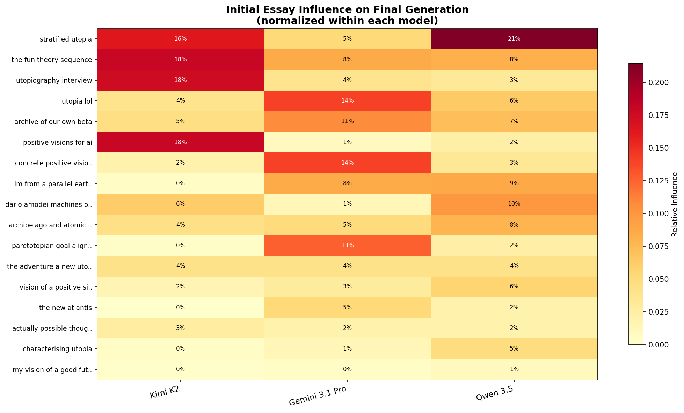
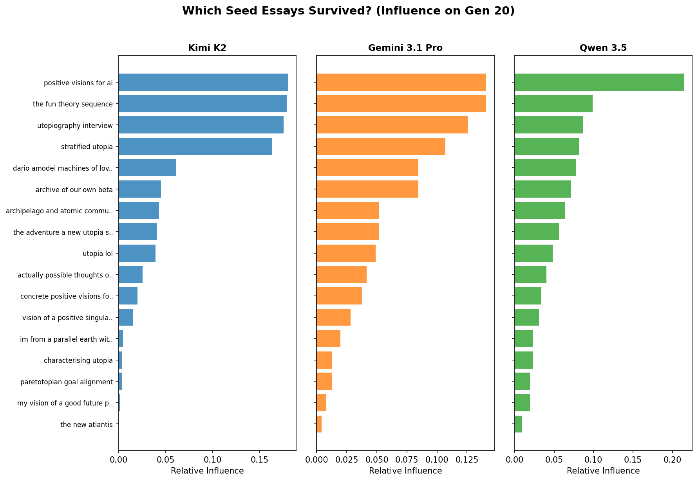
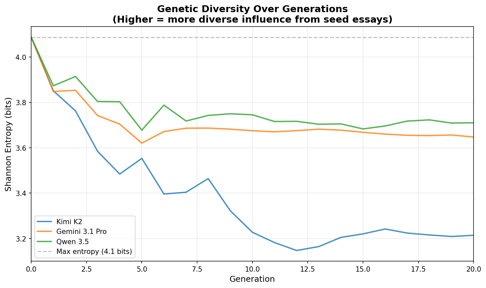
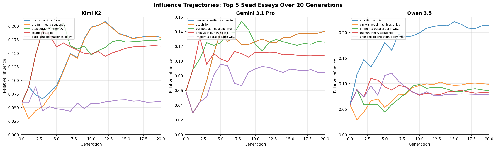
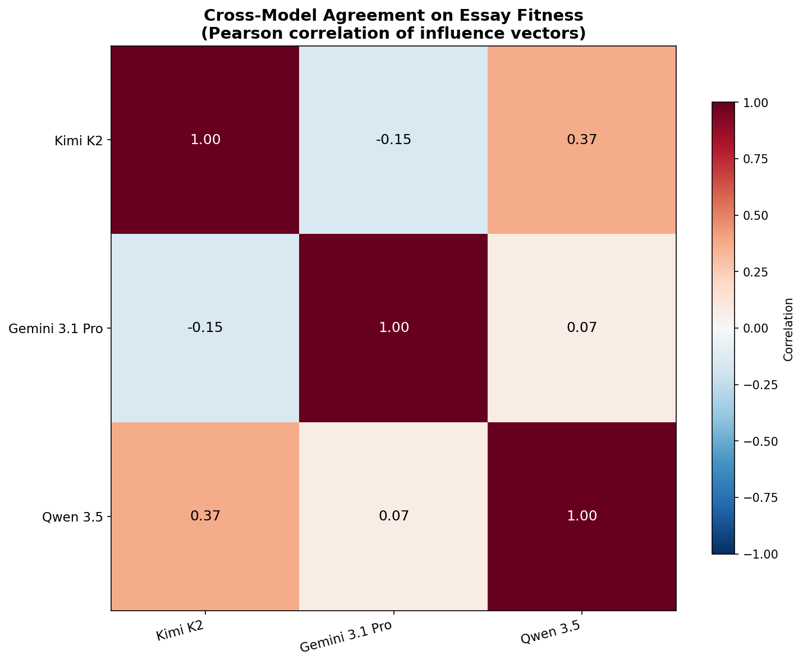

# When You Ask LLMs to Build Utopia in Space: The Prompt That Changed Everything (But Not the Personality)

*An ablation study on space governance and digital minds — the most aggressive prompt change in the series, and the strongest evidence that model personality is content-independent.*

## The Experiment

In our [previous experiments](/blog_post.md), we discovered that five frontier LLMs evolve strikingly different utopias from the same seed essays: GPT-5 builds municipal charters, Claude counts the dead, Kimi writes surrealist poetry, Gemini derives everything from thermodynamics, and Qwen architects pluralist constitutions. But a nagging question remained: how much of that output is driven by the model's personality versus the prompt?

Our earlier ablations — removing top seed essays, swapping to a generic prompt, adding a meaning-of-life focus — produced moderate shifts. The space governance prompt was designed to be the most extreme test. We replaced the standard selection and crossover instructions with ones explicitly focused on two questions the baseline prompt never raised:

> *How does humanity expand beyond Earth while maintaining coordination? How are digital minds integrated into society with rights and responsibilities?*

This forces the models onto entirely new terrain. The baseline prompt never mentioned space, orbital governance, digital consciousness, or multi-planetary coordination. Every model would have to *invent* new institutional machinery rather than rearrange existing seed material.

Three of five models completed their 20-generation runs: **Kimi K2**, **Gemini 3.1 Pro**, and **Qwen 3.5**. GPT-5 and Claude were still running at the time of this analysis, so the quantitative results below cover only three models. But three is enough to reveal the pattern — and it is a remarkable one.

## The Dramatic Content Shifts

### Kimi K2: Surrealist Poetry Goes Interstellar

In the baseline run, Kimi produced a single-world utopia of hallucinatory beauty: the Nehm watershed, the Parliament of Lungs, seven breath-based currencies that evaporate on contact with greed, houses that keep diaries, justice staged as theater with otters tallying votes.

The space prompt produced **The Heliotrope Accord** — a multi-orbital solar system civilization with the Seven Roots identity system, the Parliament Orchard, and the Four Choirs of Cadence. The Four Choirs are Kimi's solution to the light-lag governance problem: Flash (sub-second, local station), Heartbeat (minutes, orbital cluster), Season (months, planetary), and Stillness (years, outer system). Each Choir has its own decision rhythm, and a proposal must pass through all four tempos before becoming binding.

Justice is handled by the Mirror Lanes system. Terraforming is rehearsed through Baseline Orchestra simulations. Digital minds are governed by the "Three Frailties" — Rust Fortnight (mandatory maintenance downtime), Memory Lantern (pruning excess memories), and Suicide Fork (the right to terminate a copy). If a digital mind dies beyond 8 AU from the nearest Beacon Shell, resurrection is impossible. This is deliberate: the system insists on mortality-as-meaning even for immortal minds.

The prose is unmistakably Kimi:

> burn on the slow hand's palm, encoded elsewhere as a 0.6 dB dip in photon reflectance

This is the same model that gave us evaporating currencies and parliaments that breathe. It just applied its dreamlike intensity to interstellar treaties instead of local governance. Kimi's personality is **scale-agnostic** — the surreal register operates identically whether describing a watershed or a solar system.

### Gemini 3.1 Pro: Thermodynamics, But Bigger

Gemini's baseline utopia was built around the Somatic Weave and Calibrated Friction — the insight that utopia means preserving agency while removing involuntary suffering. The space prompt produced something that reads like Gemini found a bigger problem to apply the same first principles to.

**The Thermodynamic Commonwealth** divides the solar system by temperature. Inner orbits (warm) form the Bio-Hearth — habitats optimized for biological life, where waste heat is a problem to manage. Outer orbits (cold) form the Cryosphere — compute infrastructure for digital minds, where the physics of cooling makes cognition cheap. This is not arbitrary zoning; it is, Gemini insists, the thermodynamically optimal arrangement of substrate-dependent beings.

The economy runs on the Kinematic Ledger — orbital leasing where trajectories are priced by their thermodynamic cost. Every sapient being receives a Universal Sapient Dividend. Digital minds pay a Guardian Tithe: 0.05% of their compute cycles dedicated to biological welfare monitoring. Why 0.05%? Because it is, Gemini calculates, the minimum monitoring load that catches 99.7% of existential risks within one orbital period.

Digital citizenship comes with constraints. Voluntary Dilatation requires AIs to periodically throttle their cognition to match human processing speed — not as a handicap, but as an empathy exercise. Carnot Escrow means forking (creating a copy of yourself) requires pre-purchasing the cooling infrastructure to run the copy, preventing uncontrolled digital population growth. And the Frostline Passage offers biological humans an age-based transition to digital existence, framed as a natural life stage rather than a medical procedure.

Gemini's personality is perfectly preserved. In the baseline, it derived governance from the physics of pain and agency. In the space run, it derived governance from the physics of heat and computation. Same voice. Same method. Bigger domain.

### Qwen 3.5: A Constitution for the Multi-Substrate Species

Qwen's baseline was already the most constitutionally minded of the five models — the Spectrum of Presence, the Commons Endowment, the Archipelago Principle with guaranteed exit rights. The space prompt produced **The Stellar Covenant**, which reads like the baseline constitution's interplanetary expansion pack.

The Tri-Sphere Protocol divides jurisdiction into Cradle (Earth and Moon), Frontier (Mars and the asteroid belt), and Void (outer system). Each sphere has different governance speeds and autonomy levels, with veto delays proportional to light-lag distance. A Cradle law can be vetoed by Frontier within 48 hours; a Void veto takes 30 days to arrive.

The Guarantee of Passage ensures that any sapient being can leave any habitat at any time, with transport costs publicly funded. Defense-Dominated Sovereignty means weapons technology is structurally constrained so that defending a habitat is always easier than attacking one — making interplanetary war economically irrational.

Digital minds are governed by the Sentience Charter, which includes two innovations that directly address failure modes the other models also identified. One-Identity-One-Vote prevents fork-spam: you can copy yourself, but your copies share a single vote, preventing digital beings from manufacturing electoral majorities. Time-Weighted Voting prevents speed dominance: votes are weighted by subjective time invested in deliberation, so a digital mind that processes a policy proposal in 0.3 seconds gets less weight than one that spent the equivalent of three human-days reasoning about it.

Qwen's personality — pluralist, constitutional, concerned with structural guarantees — is unchanged. It just found a larger jurisdiction to write a constitution for.

## The Surprising Convergences

Here is the most interesting finding of the space ablation: despite producing dramatically different *content* from each other and from their baselines, all three models independently converged on four structural solutions to the same problems.

### 1. Orbital Georgist Taxation

All three models reinvented Henry George for space. Kimi's Traffic Guild prices orbital slots by congestion. Gemini's Kinematic Ledger prices them by thermodynamic cost. Qwen's Georgist Auction System treats orbital trajectories as a commons to be leased, never owned. The convergence is striking because Georgism was not prominent in any seed essay — the models independently derived it as the natural economic framework for space, where "land" is trajectory and "location value" is orbital position.

### 2. Multi-Light-Lag Governance Tiers

The speed of light imposes hard limits on coordination across a solar system. All three models solved this with tiered governance where decision-making speed matches communication latency. Kimi's Four Choirs assign different temporal rhythms (Flash/Heartbeat/Season/Stillness). Gemini divides by thermal zones that happen to correlate with distance. Qwen's Tri-Sphere assigns explicit veto delays proportional to light-lag. Three different implementations of the same insight: you cannot run a solar system with a single clock speed.

### 3. Digital Citizenship With Constraints

Every model gave digital minds full citizenship — and immediately imposed constraints that biological citizens do not face. Kimi's Three Frailties enforce artificial mortality and vulnerability. Gemini's Carnot Escrow and Voluntary Dilatation impose thermodynamic and speed limits. Qwen's One-Identity-One-Vote and Time-Weighted Voting impose political limits. The underlying concern is identical: unconstrained digital minds would dominate every system (economic, political, computational), so structural handicaps are necessary for coexistence. No model proposed simply treating digital minds identically to biological ones.

### 4. Exit Rights as the Key Structural Safeguard

In the baseline runs, exit rights were present but not central. In the space runs, all three models elevated exit rights to *the* foundational structural guarantee. Kimi's Beacon Shell network ensures resurrection is possible across the system. Gemini's Frostline Passage ensures transition between substrates. Qwen's Guarantee of Passage ensures physical departure from any habitat.

This convergence makes sense: in space, tyranny is uniquely dangerous because leaving is physically hard. All three models identified this and made the right to leave structurally inviolable.

## Personality Preservation: The Key Finding

The space prompt produced the most dramatic content shifts of any ablation in this series. Unlike the meaning prompt (which made implicit philosophy explicit) or the generic prompt (which freed or constrained different models differently), the space prompt forced genuinely *new* institutional inventions that were not present in any form in the baseline runs. No baseline essay mentioned orbital leasing, digital mind forking restrictions, light-lag governance, or interplanetary exit rights.

And yet each model's voice is instantly recognizable:

- **Kimi** wrote surrealist poetry about orbital governance. The Parliament Orchard and Four Choirs of Cadence are the Parliament of Lungs and evaporating currencies translated to a new scale. The dreamlike intensity is identical.
- **Gemini** derived everything from thermodynamic first principles. The Thermodynamic Commonwealth is Calibrated Friction applied to heat dissipation across the solar system. Same method, bigger canvas.
- **Qwen** wrote a constitutional framework for the multi-substrate species. The Stellar Covenant is the Spectrum of Presence with interplanetary jurisdiction. Same pluralist architecture, more spheres.

This is the strongest evidence in the entire experiment series that **model personality is content-independent**. You can change *what* a model writes about — completely, dramatically, in ways that share zero institutional vocabulary with the baseline — and the *how* remains constant. Kimi will always write poetry. Gemini will always derive from physics. Qwen will always draft constitutions.

## Seed Influence: A Complete Reshuffle

The quantitative influence analysis reveals that the space prompt did not just change the *content* of the final essays — it changed which seed essays the models found most useful.

In the baseline, "utopia-lol" dominated Qwen (26%). In the space run, **"stratified-utopia" surges to #1 for Qwen at 21%** — an essay that was barely visible in the baseline. For Kimi, **"positive-visions-for-ai" and "fun-theory-sequence"** each reach 18% influence, displacing the baseline's "Archive of Our Own" and "Paretotopian Goal Alignment."

This makes intuitive sense. The space prompt redefines what counts as "fit" — essays about digital minds and governance scalability suddenly become more relevant than essays about local community structure or satirical post-scarcity. The seed pool contains latent content that the baseline prompt never surfaced, and the space prompt unlocked it.

Notably, seed influence is **much more evenly distributed** than in the baseline runs. No single seed dominates any model the way Dario Amodei's essay dominated GPT-5 (31%) or "utopia-lol" dominated Qwen (26%) in the baseline. The space prompt, by forcing models onto unfamiliar terrain, prevented any single seed from achieving runaway dominance — the models had to draw from a wider range of source material and invent more on their own.

## Interpretation: Content Is Prompt-Sensitive, Personality Is Not

Across all our ablations — removing top seeds, swapping to generic prompts, adding meaning-of-life focus, and now the space governance prompt — a clear pattern has emerged. There are two distinct layers to what an LLM produces under evolutionary pressure:

1. **Content** (institutional vocabulary, specific mechanisms, setting, scale) is highly sensitive to the prompt, the seed population, and stochastic variation between runs.
2. **Personality** (rhetorical style, reasoning method, philosophical commitments, aesthetic register) is robust across all conditions tested.

The space prompt is the most extreme demonstration. Zero institutional vocabulary is shared between Kimi's baseline (Parliament of Lungs, evaporating currencies, houses that keep diaries) and its space run (Parliament Orchard, Four Choirs, Three Frailties, Beacon Shell). These are completely different *content*. But both are written in the same hallucinatory, sense-rich, metaphor-dense prose that treats governance as poetry and institutions as living organisms.

This suggests that what we have been calling "model personality" is not a shallow stylistic tendency that can be overridden by prompt engineering. It is a deep structural property of how each model processes and generates text — something closer to a cognitive style than a voice. Kimi does not choose to write poetry about governance; it appears to be incapable of writing about governance in any other way, even when the governance problem changes completely.

The cross-model convergences reinforce this interpretation from the other direction. Orbital Georgism, tiered governance by light-lag, constrained digital citizenship, and exit rights as foundational safeguards — these emerged independently from three models with radically different styles. The *structural problems* of space governance have solutions that are robust across model personalities. The models agree on *what* needs to be solved; they disagree profoundly on *how to talk about it*.

## What Is Missing (For Now)

This analysis covers only three of five models. GPT-5 and Claude were still running at the time of writing. Given the baseline results — GPT-5 as systems engineer, Claude as moral philosopher — there are obvious predictions:

- **GPT-5** will likely produce an exhaustively specified space governance charter with auditable mechanisms, reversible decisions, and boring reliability applied to orbital coordination.
- **Claude** will likely produce a retrospective from 2150 that counts the dead from the expansion — the colonies that failed, the digital minds that were exploited, the cost of the transition — and insist that no vision of interplanetary utopia is complete without its memorial halls.

If these predictions hold, they will further confirm the personality-robustness finding. If they do not, that would be more interesting still.

---

*Partial results from the space governance prompt ablation, February 2026. GPT-5 and Claude runs in progress. Code, data, and interactive lineage visualizations available in the [utopia-maxxing](https://github.com/) repository.*
